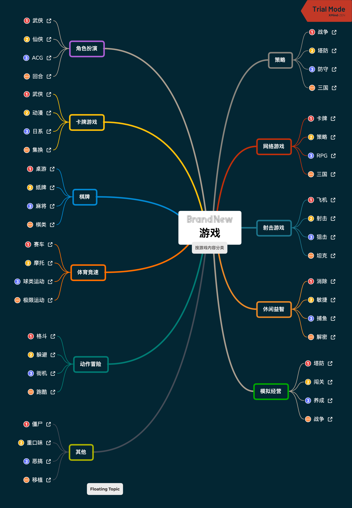
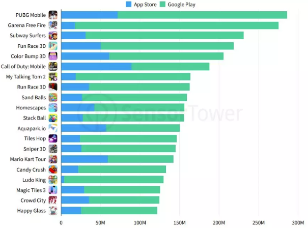
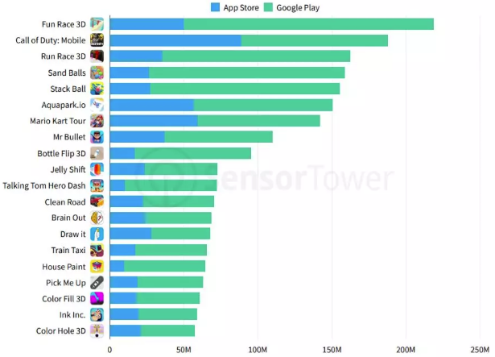

# Homework1

## 游戏分类

## 游戏市场的热点

2019年全球手游下载总榜为：

从这个排行榜可以看出，多人竞技类游戏(Moba)占据绝对的游戏市场热点，《PUBG Mobile》和《Garena Free Fire》领绝冠亚，都是Moba类竞技手游

而2019年全球新游下载榜为：

从这个排行榜可以看出，超悠闲手游成为了游戏市场的新热点。超休闲游戏席卷了2019的新游戏下载榜单，前十有八都是超休闲手游。Good Job Game的《Fun Race 3D》夺得2019新游戏榜单头名。

《使命召唤手游》和《马力欧赛车巡回赛》成功从超休闲游戏的洪流中占据一席之地。《使命召唤手游》尽管在9月30号才发布，却已经有了超过1.8亿的安装量。
