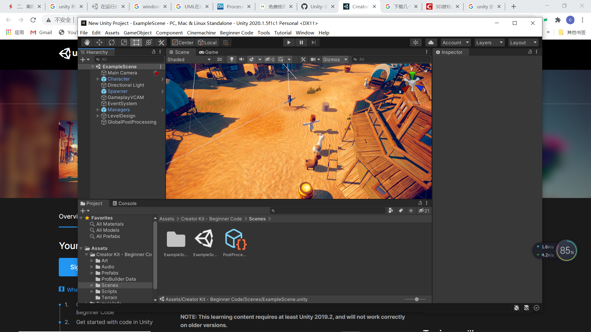
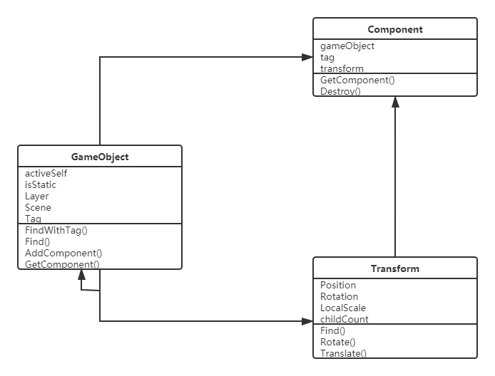
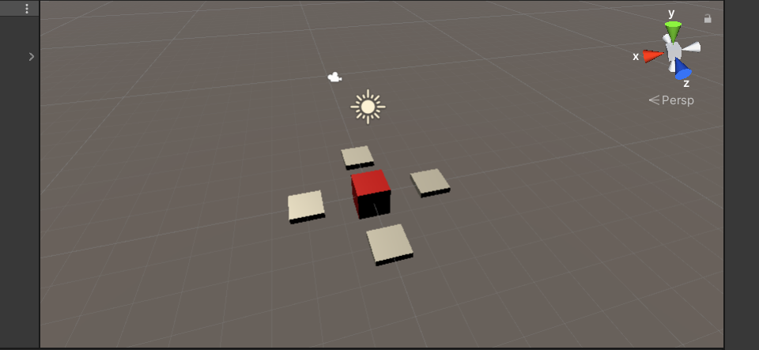
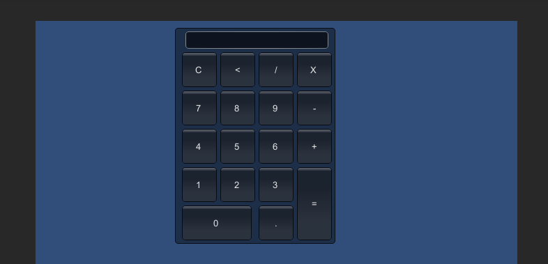

# Homework2

## 简答题 

### 解释游戏对象（GameObjects）和资源（Assets）的区别与联系

区别 ：
* 资源（asset）就是可以在我们的项目中使用的文件，包括图像、视频、脚本文件、预制文件等，它们的存在不依赖于Unity
* 对象（Object）是Unity创建的实例，你可以在inspector窗口中调整它们的属性。其中游戏对象（GameObject），出现在场景中的所有物体都是GameObject，GameObject按照一定的层次结构组织起来，显示在Hierarchy窗口中

联系：
* 对象可以通过资源来保存起来，资源可以用来创建对象实例，一个资源可以创建多个对象

### 下载几个游戏案例，分别总结资源、对象组织的结构（指资源的目录组织结构与游戏对象树的层次结构）

每个Unity的项目包含一个资源文件夹。此文件夹的内容呈现在项目视图。这里存放着游戏的所有资源，在资源文件夹中，通常有对象、材质、场景、声音、预设、贴图、脚本、动作，在这些文件夹下可以继续进行划分。  

游戏对象树层次视图包含了每一个当前场景的所有游戏对象。其中一些是资源文件的实例，如3D模型和其他预制物体的实例。可以在层次结构视图中选择对象或者生成对象。当在场景中增加或者删除对象，层次结构视图中相应的对象则会出现或消失。想让一个游戏对象成为另一个的子对象，只需在层次视图中把它拖到另一个上即可。一个子对象将继承其父对象的移动和旋转属性

在Unity Hub的学习项目里面选择一个Creator Kit项目下载：


可以看到该项目的资源包括：
* Art
* Audio
* Prefabs
* ProBuilder Data
* Scenes
* Scrips
* Terrain

游戏对象包括：
* Character
* Main Camera
* Directional Light
* Spawner
* GameplayVCAM
* EventSystem
* Managers
* LevelDesign
* GlobalPostProcessing

### 编写一个代码，使用debug语句来验证MonoBehaviour基本行为或事件触发的条件

* 基本行为包括`Awake()`,`Start()`,`Update()`,`FixedUpdate()` ,`LateUpdate()`
* 常用事件包括`OnGUI()`,`OnDisable()`,`OnEnable()`

代码为：
```
using System.Collections;
using System.Collections.Generic;
using UnityEngine;

public class Script : MonoBehaviour
{

	// Use this for initialization
	void Start()
	{
		Debug.Log("This Start!");
	}

	// Update is called once per frame
	void Update()
	{
		Debug.Log("This Update!");	
	}

	void OnEnable()
	{
		Debug.Log("This Enabled!");
	}

	void OnDisable()
	{
		Debug.Log("This Disabled!");
	}

    void Awake()
    {
		Debug.Log("This Awake!");
    }

    void FixedUpdate()
    {
		Debug.Log("This FixedUpdate");
    }

    void LateUpdate()
    {
		Debug.Log("This LateUpdate");
    }

    void OnGUI()
    {
		if (GUILayout.Button("Press Me"))
			Debug.Log("This OnGUI!");
	}
}
```

其中各个事件的触发条件为：

* `Awake()`：Awake在MonoBehavior创建后就立刻调用
* `Start()`：Start将在MonoBehavior创建后在该帧Update之前，在该Monobehavior.enabled == true的情况下执行
* `Update()`：当MonoBehaviour启用时，其Update在每一帧被调用
* `FixedUpdate()`：当MonoBehaviour启用时，其 FixedUpdate在每一帧被调用。处理Rigidbody时，需要用FixedUpdate代替Update。例如:给刚体加一个作用力时，你必须应用作用力在FixedUpdate里的固定帧，而不是Update中的帧。(两者帧长不同)
* `LateUpdate()`：当Behaviour启用时，其LateUpdate在每一帧被调用。LateUpdate是在所有Update函数调用后被调用。这可用于调整脚本执行顺序。例如:当物体在Update里移动时，跟随物体的相机可以在LateUpdate里实现。
* `OnGUI()`：当接收到事件`Event`才会被调用
* `OnEnable()`：只有在Object处于激活状态时才会被调用，除了满足GameObject被激活外，还实时地检测函数所在的脚本是否被启用，每次GameObject.Active或者Behaviour.enable的状态变化时都会被调用
* `OnDisable()`：与`OnEnable`相反

### 查找脚本手册，了解`GameObject`，`Transform`，`Component`对象

#### 分别翻译官方对三个对象的描述(Description)

* GameObject:Every object in your game is a GameObject, from characters and collectible items to lights, cameras
 and special effects. However, a GameObject can’t do anything on its own; you need to give it properties before it can become a character, an environment, or a special effect. 游戏中的每个对象（从角色和可收集物品到光源、摄像机和特效）都是游戏对象。但是，游戏对象本身无法执行任何操作；您需要向游戏对象提供属性，然后游戏对象才能成为角色、环境或特效。
* The Transform component determines the Position, Rotation, and Scale of each object in the scene. Every GameObject has a Transform. Transform 组件确定每个对象在场景中的 Position、Rotation 和 Scale 属性的值。每个游戏对象都有一个变换组件。
* A GameObject is an object in the Unity Editor which contains components. Components define the behaviour of that GameObject. 一个游戏对象包含多个组件

#### 描述下图中 table 对象（实体）的属性、table 的 Transform 的属性、 table 的部件

* table的属性：name、static、layer、tag、prefab
* Transform的属性：position、rotation、scale
* table的部件：transform、cube、box collider、mesh renderer等

#### 用UML图描述三者的关系



### 资源预设与对象克隆

* 预设的好处：
  * 模板功能：当你搭建地形时，费了九牛二虎之力完成后，此时假如另外场景也要用到，还需要重新弄一遍吗？没有预制体是的，有了预制体，你可以在任何地方复用这个模型。这也是最常用的特征
  * 一变百变：当场景中有很多由预制体生成的对象时，如果想修改他们的某个属性，无需一个一个的修改，只需要改其中的一个，当Apply提交后，所有的预制体分身，都会发生改变
  * 代码控制：对于非系统提供的模型，只有制作成预制体的对象，才可以使用代码动态生成。否则只能在游戏发布之前一个一个的摆好了， 这显然不能满足游戏逻辑（比较子弹，就是动态生成的）
* 预设与对象克隆的关系：预设修改的复杂度降低，一旦需要修改所有相同属性的对象，只需要修改预设即可，所有通过预设实例化的对象都会做出相应变化。而克隆只是复制一个一模一样的对象，这个对象独立于原来的对象，在修改的过程中不会影响原有的对象，这样不方便整体改动。
* 制作 table 预制，写一段代码将 table 预制资源实例化成游戏对象

table预制：


将预制资源实例化的代码：
```
using System.Collections;
using System.Collections.Generic;
using UnityEngine;

public class PrefadesInstantiate : MonoBehaviour
{
    public Transform table;

    void Start() 
    {
        Instantiate(table, new Vector3(5, 0, 5), Quaternion.identity);
    }
}

```


## 计算器代码

将以下代码直接拖进`Main Camera`就可以了，实现的只是一个简单的计算器：
* 不支持错误输入的检测
* 不支持浮点数计算
* 只支持加减乘除、复位、后退的功能

GUI界面：


```
using System;
using System.Collections;
using System.Collections.Generic;
using UnityEngine;

public class Caculator : MonoBehaviour
{

    private string res = "";
    // Start is called before the first frame update
    void Start()
    {
        
    }

    // Update is called once per frame
    void Update()
    {
        
    }

    private bool reset = false;
    
    void OnGUI()
    {
        // 创建背景板 
        GUI.Box(new Rect(200, 10, 230, 310), "");
        
        // 创建显示区域
        GUI.TextField(new Rect(215, 15, 205, 25), res);
        
        // 创建数字 
        for (int i = 0; i < 3; i++)
        {
            for (int j = 0; j < 3; j++)
            {
                if (GUI.Button(new Rect(210 + 50 * j + j * 5, 260 - 50 * (i + 1) - i * 5, 50, 50),
                    "" + (i * 3 + j + 1)))
                {
                    if (reset)
                    {
                        res = "";
                        reset = false;
                    }
                    res += "" + (i * 3 + j + 1);
                }
            }
        }
        
        // 创建C, <, /, X
        if (GUI.Button(new Rect(210, 45, 50, 50), "C"))
        {
            res = "";
        }

        if (GUI.Button(new Rect(265, 45, 50, 50), "<"))
        {
            res = res.Substring(0, res.Length-1);
        }

        if (GUI.Button(new Rect(320, 45, 50, 50), "/"))
        {
            res += "/";
        }

        if (GUI.Button(new Rect(375, 45, 50, 50), "X"))
        {
            res += "X";
        }

        // 创建-, +, =
        if (GUI.Button(new Rect(375, 100, 50, 50), "-"))
        {
            res += "-";
        }

        if (GUI.Button(new Rect(375, 155, 50, 50), "+"))
        {
            res += "+";
        }

        if (GUI.Button(new Rect(375, 210, 50, 105), "="))
        {
            int tmp = Cal(res);
            res = Convert.ToString(tmp);
            reset = true;
        }
        
        // 创建0, .
        if (GUI.Button(new Rect(210, 265, 100, 50), "0"))
        {
            if (reset)
            {
                res = "";
                reset = false;
            }
            res += "0";
        }

        if (GUI.Button(new Rect(320, 265, 50, 50), "."))
        {
            res += ".";
        }
    }

    private bool isNumber(string str)
    {
        foreach (char c in str)
        {
            if ((c < '0' || c > '9') && c != '.')
            {
                return false;
            }
        }

        return true;
    }


    private class node
    {
        public string val;
        public node left;
        public node right;

        public node(string v)
        {
            val = v;
            left = null;
            right = null;
        }
    }

    private node createTree(string str)
    {
        
        if (isNumber(str))
        {
            return new node(str);
        }

        if (str == "")
        {
            return null;
        }

        string left = "";
        string right = "";

        for (int i = 0; i < str.Length; i++)
        {
            if (str[i] == '+' || str[i] == '-')
            {
                for (int j = 0; j < i; j++)
                {
                    left += str[j];
                }

                for (int j = i + 1; j < str.Length; j++)
                {
                    right += str[j];
                }

                node new_node = new node(str[i].ToString());
                new_node.left = createTree(left);
                new_node.right = createTree(right);
                return new_node;
            }
        }
        
        for (int i = 0; i < str.Length; i++)
        {
            if (str[i] == 'X' || str[i] == '/')
            {
                for (int j = 0; j < i; j++)
                {
                    left += str[j];
                }

                for (int j = i + 1; j < str.Length; j++)
                {
                    right += str[j];
                }

                node new_node = new node(str[i].ToString());
                new_node.left = createTree(left);
                new_node.right = createTree(right);
                return new_node;
            }
        }

        return null;
    }

    
    
    private int calculate(node root)
    {
        if (root == null)
        {
            return 0;
        }

        if (isNumber(root.val))
        {
            return int.Parse(root.val);
        }

        if (root.val == "+")
        {
            return calculate(root.left) + calculate(root.right);
        }

        if (root.val == "-")
        {
            return calculate(root.left) - calculate(root.right);
        }

        if (root.val == "X")
        {
            return calculate(root.left) * calculate(root.right);
        }

        if (root.val == "/")
        {
            return calculate(root.left) / calculate(root.right);
        }

        return 0;
    }

    private int Cal(string str)
    {
        return calculate(createTree(str));
    }
}

```