# Homework3

## 简答并用程序验证

### 游戏对象运动的本质是什么？

游戏对象运动的本质，其实是游戏对象跟随每一帧的变化，空间地变化。这里的空间变化包括了游戏对象的transform属性中的position跟rotation两个属性。一个是绝对或者相对位置的改变，一个是所处位置的角度的旋转变化

### 用三种以上方法实现物体的抛物线运动

* 第一种：将`transform.position`的改变看成是水平方向的匀速运动和垂直方向的恒加速运动的合成，实现代码如下：
```
using System.Collections;
using System.Collections.Generic;
using UnityEngine;

public class Move : MonoBehaviour
{

    // Start is called before the first frame update
    public float x_speed;    //x方向的速度
    public float y_speed;    //y方向的速度
    public float g; // 重力加速度
    void Start()
    {
        x_speed = 3;
        y_speed = 4;
        g = 10;
    }

    // Update is called once per frame
    void Update()
    {
        y_speed -= g * Time.deltaTime;
        this.transform.position += Vector3.right * Time.deltaTime * x_speed;
        this.transform.position += Vector3.up * Time.deltaTime * y_speed;
    }
}
```

* 第二种：用Vector3来实现`transform.position`的改变，实现代码如下：
```
using System.Collections;
using System.Collections.Generic;
using UnityEngine;

public class Move2 : MonoBehaviour
{

    // Start is called before the first frame update
    public float x_speed;    //x方向的速度
    public float y_speed;    //y方向的速度
    public float g; // 重力加速度
    void Start()
    {
        x_speed = 3;
        y_speed = 4;
        g = 10;
    }

    // Update is called once per frame
    void Update()
    {
        this.transform.position += new Vector3(Time.deltaTime * x_speed, Time.deltaTime * y_speed, 0);
        y_speed -= g * Time.deltaTime;
    }
}
```
* 第三种：使用`transform.Translate`函数来修改物体的位置，实现代码如下：
```
using System.Collections;
using System.Collections.Generic;
using UnityEngine;

public class Move3 : MonoBehaviour
{

    // Start is called before the first frame update
    public float x_speed;    //x方向的速度
    public float y_speed;    //y方向的速度
    public float g; // 重力加速度
    void Start()
    {
        x_speed = 3;
        y_speed = 4;
        g = 10;
    }

    // Update is called once per frame
    void Update()
    {
        this.transform.Translate(Vector3.right * Time.deltaTime * x_speed + Vector3.up * Time.deltaTime * y_speed);
        y_speed -= g * Time.deltaTime;
    }
}
```

### 实现一个完整的太阳系

**要求**：
* 其他星球围绕太阳的转速必须不一样
* 不在一个法平面上

首先创建一系列球体，然后将其命名为各大行星的名字：

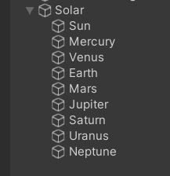

然后再网上找到各个行星的表面图，并拖进对应的球体作成Material:
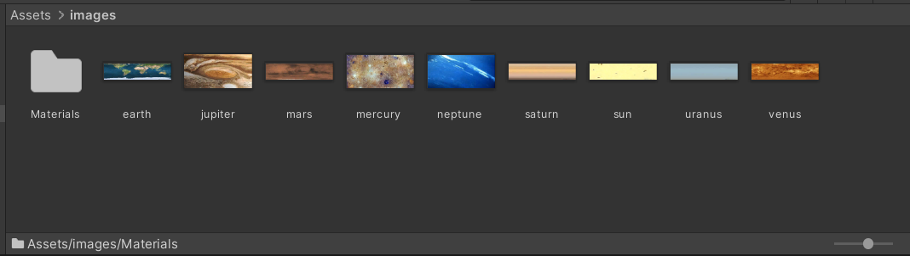

然后可以得到效果图如下：
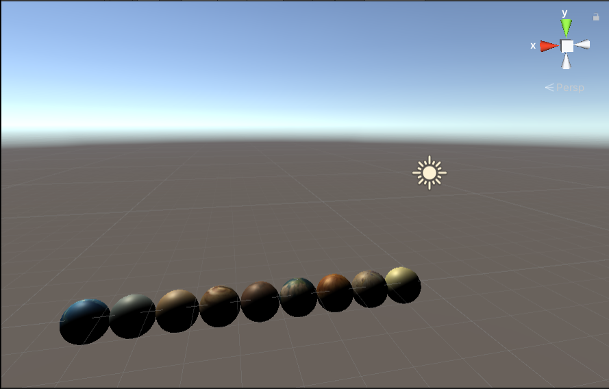

之后编写脚本如下：
```
using System.Collections;
using System.Collections.Generic;
using UnityEngine;

public class Solar : MonoBehaviour
{

    public Transform sun;
    public Transform mercury;
    public Transform venus;
    public Transform earth;
    public Transform mars;
    public Transform jupiter;
    public Transform saturn;
    public Transform uranus;
    public Transform neptune;


    // Start is called before the first frame update
    void Start()
    {
        sun.position = Vector3.zero;
        mercury.position = new Vector3(5, 0, 0);
        venus.position = new Vector3(8, 1, 0);
        earth.position = new Vector3(11, 2, 0);
        mars.position = new Vector3(14, 3, 0);
        jupiter.position = new Vector3(20, -1, 0);
        saturn.position = new Vector3(27, -2, 0);
        uranus.position = new Vector3(35, -3, 0);
        neptune.position = new Vector3(40, 0, 0);

        sun.localScale = new Vector3(7, 7, 7);
        mercury.localScale = new Vector3(1, 1, 1);
        venus.localScale = new Vector3(2, 2, 2);
        earth.localScale = new Vector3(2, 2, 2);
        mars.localScale = new Vector3(1, 1, 1);
        jupiter.localScale = new Vector3(5, 5, 5);
        saturn.localScale = new Vector3(5, 5, 5);
        uranus.localScale = new Vector3(3, 3, 3);
        neptune.localScale = new Vector3(3, 3, 3);
    }

    // Update is called once per frame
    void Update()
    {
        mercury.RotateAround(sun.position, new Vector3(0, 1, 0), 100 * Time.deltaTime);
        mercury.Rotate(Vector3.up * 30 * Time.deltaTime);

        venus.RotateAround(sun.position, new Vector3(1, -8, 0), 90 * Time.deltaTime);
        venus.Rotate(Vector3.up * 30 * Time.deltaTime);

        earth.RotateAround(sun.position, new Vector3(2, -11, 0), 80 * Time.deltaTime);
        earth.Rotate(Vector3.up * 30 * Time.deltaTime);

        mars.RotateAround(sun.position, new Vector3(3, -14, 0), 70 * Time.deltaTime);
        mars.Rotate(Vector3.up * 30 * Time.deltaTime);

        jupiter.RotateAround(sun.position, new Vector3(1, 20, 0), 60 * Time.deltaTime);
        jupiter.Rotate(Vector3.up * 30 * Time.deltaTime);

        saturn.RotateAround(sun.position, new Vector3(2, 27, 0), 50 * Time.deltaTime);
        saturn.Rotate(Vector3.up * 30 * Time.deltaTime);

        uranus.RotateAround(sun.position, new Vector3(3, 35, 0), 40 * Time.deltaTime);
        uranus.Rotate(Vector3.up * 30 * Time.deltaTime);

        neptune.RotateAround(sun.position, new Vector3(0, 2, 1), 30 * Time.deltaTime);
        neptune.Rotate(Vector3.up * 30 * Time.deltaTime);

        
    }
}

```

可以看到我们设置了多个行星的`transform`，这些是作为外部组件进行导入，然后在`start`函数中，我们设置这些行星和太阳的位置、大小等参数，并且在`update`函数中，我们设置它们的运动轨迹。在这里需要特别注意的是，由于我们将太阳设置在`(0, 0, 0)`的位置中，那么行星要以太阳为中心公转，它绕的轴所对应的向量与它的位置与太阳连线所形成的向量是相互垂直的。我们用`(x, y, z)`代表行星的位置向量，用`(x', y', z')`代表它旋转所绕的轴，那么必须要满足的是：
$$
    xx' + yy' + zz' = 0
$$

写好脚本之后创建一个空对象(`Create Empty`)，然后将脚本拖入这个空对象中，然后在`Inspector`中将行星组件导入：
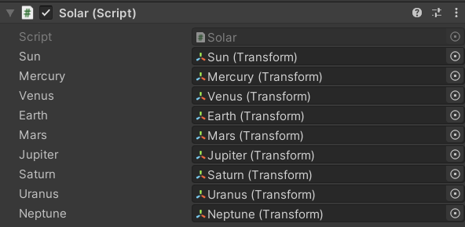

之后点击运行按钮，可以看到游戏运行效果如下：
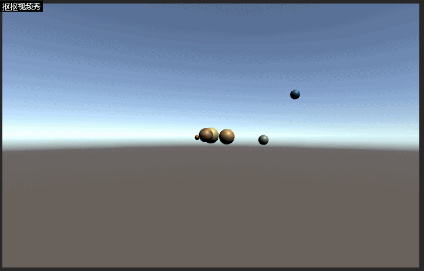

## 编程实践：实现游戏《牧师与魔鬼》

首先在unity商店上下载几个人物模型：

牧师:
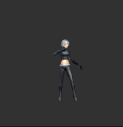

魔鬼：
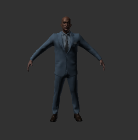

还有船模型：
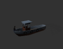

然后把它们做成预制：
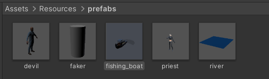

完成了之后可以使用`Instantiate`函数将这些预制导入

然后使用MVC架构来完成整个游戏项目

### 组织游戏资源

游戏资源组成如下：
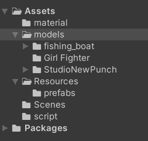

Assets一共分为5个部分：
* material：保存制作好的材料
* models：保存导入的游戏模型
* Resource：保存游戏的资源，包括预制等
* Scenes：保存游戏的场景
* script：保存游戏的脚本

### 创建场景启动器和控制器

构造Main空对象，并挂载FirstController代码，使得游戏加载行为处于控制之下

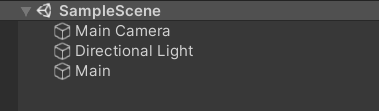

启动时，游戏就一个对象有代码

### Director（导演）对象与单实例模式

创建 SSDirector 类，其职责大致如下：

* 获取当前游戏的场景
* 控制场景运行、切换、入栈与出栈
* 暂停、恢复、退出
* 管理游戏全局状态
* 设定游戏的配置
* 设定游戏全局视图

实现的代码大概如下：
```
using System.Collections;
using System.Collections.Generic;
using UnityEngine;

public class SSDirector : System.Object
{

    private static SSDirector _instance;
    public ISceneController currentSceneController { get; set; }
    public bool running { get; set; }

    public static SSDirector getInstance()
    {
        if(_instance == null)
        {
            _instance = new SSDirector();
        }
        return _instance;
    }

    public int getFPS()
    {
        return Application.targetFrameRate;
    }

    public  void setFPS(int fps)
    {
        Application.targetFrameRate = fps;
    }

}
```

### 接口

可以实现一个`ISceneController`接口，因为：
* 每个场景都有自己的场记，导演需要与不同场景打交道
* 导演只知道场记有加载资源、暂停、恢复等行为，但并不知道实现细节，如：暂停前要保存哪些状态等
* 导演也不希望知道细节，而是规定场记们必须会做什么，怎么做自由发挥。这个规定就是接口

总之，通过 ISceneController 多态实现，场记和导演之间关系变松弛了。导演不需要知道场记是张三、李四，仅需要知道这个人穿了件带场记标记（接口）的衣服，就可执行导演的指挥任务

实现的代码如下：
```
using System.Collections;
using System.Collections.Generic;
using UnityEngine;

public interface ISceneController
{
    void LoadResources();
    void Pause();
    void Resume();
}
```

### 门面（Fasàde）模式与交互行为设计

门面（Fasàde）模式的概念概念:
* 外部与一个子系统的通信必须通过一个统一的门面(Facade)对象进行

该游戏的用户行为列表为
|玩家动作（事件）|条件|结果（游戏对象动作）|
|:-------------:|:-:|:------------------:|
|重置游戏||重新开始游戏|
|牧师上船|船没满员并且岸上有牧师|将一名牧师放到船上|
|魔鬼上船|船没满员并且岸上有魔鬼|将一名魔鬼放到船上|
|牧师上岸|船上有牧师|将一名牧师放到岸上|
|魔鬼上岸|船上有魔鬼|将一名魔鬼放到岸上|
|船过河|船上至少有一个人|将船开到河的另一边|

代码实现如下：
```
using System.Collections;
using System.Collections.Generic;
using UnityEngine;

public class UserGUI : MonoBehaviour
{
    private IUserAction action;
    public void Start()
    {
        action = SSDirector.getInstance().currentSceneController as IUserAction;
    }
    public void OnGUI()
    {
        float width = Screen.width / 6;
        float height = Screen.height / 12;
        if(GUI.Button(new Rect(0, 0, width, height), "Reset"))
        {
            action.Reset();
        }

        if(GUI.Button(new Rect(0, height + 1, width, height), "Priest boarding"))
        {
            action.PriestBoarding();
        }

        if(GUI.Button(new Rect(0, (height + 1) * 2, width, height), "Devil boarding"))
        {
            action.DevilBoarding();
        }

        if (GUI.Button(new Rect(0, (height + 1) * 3, width, height), "Priest go ashore"))
        {
            action.PriestGoAshore();
        }

        if (GUI.Button(new Rect(0, (height + 1) * 4, width, height), "Devil go ashore"))
        {
            action.DevilGoAshore();
        }

        if(GUI.Button(new Rect(0, (height + 1) * 5, width, height), "Boat go"))
        {
            action.BoatGo();
        }
    }
}

```

通过接口与后面的场记联系起来，按钮触发的事件逻辑由场记来实现：
```
using System.Collections;
using System.Collections.Generic;
using UnityEngine;

public interface IUserAction
{
    void Reset();
    void PriestBoarding();
    void DevilBoarding();
    void PriestGoAshore();
    void DevilGoAshore();
    void BoatGo();
}
```


### SceneController（场记）

创建 XXXSceneController 类，例如 FirstSceneController，其职责大致如下：

* 管理本次场景所有的游戏对象
* 协调游戏对象（预制件级别）之间的通讯
* 响应外部输入事件
* 管理本场次的规则（裁判）
* 各种杂务

由于
