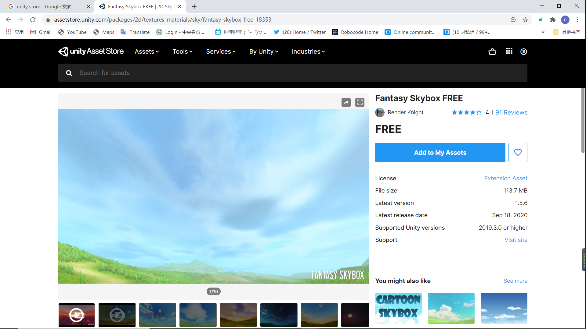
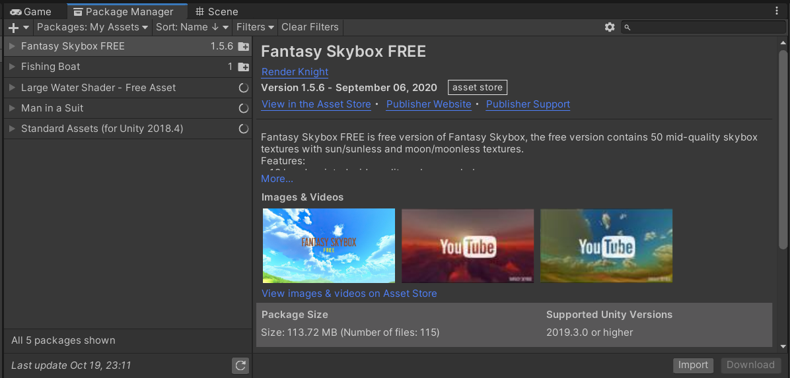
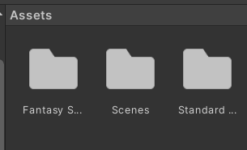
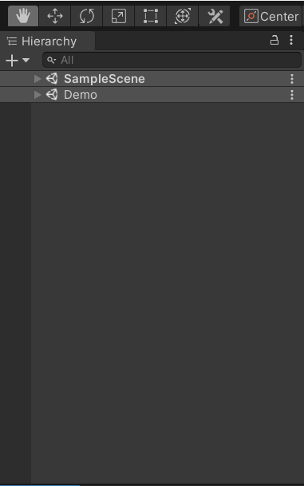
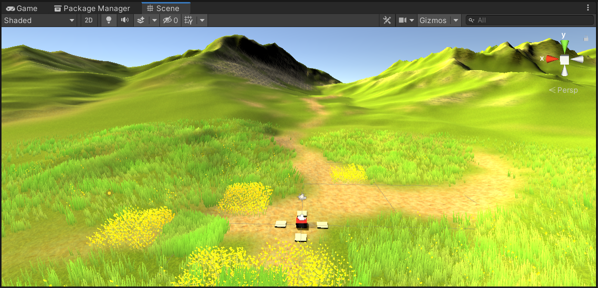

# Homework4

## 基本操作演练

### 下载Fantasy Skybox FREE，构建自己的游戏场景

首先到unity store 搜索Fantasy skybox FREE：



然后点击Add to My Assets，将资源加入到自己的Assets中

然后跳到Unity Editor,切换到Package Manager，可以看到skybox已经加入到package管理器中：



然后点击download，然后将`Character`、`CrossPlatformInput`、`Utility`三个包import到自己的Assets中：



然后将`Fantasy Skybox FREE/Scenes`中的Demo场景拖到左边场景栏中：


然后就可以看到自己创建的游戏场景了：



### 写一个简单的总结，总结游戏对象的使用

* GameObject的创建 
  * GameObject->3D Object->选择要创建的游戏对象
  * 在脚本中实例化：GameObject.CreatPrimitive
* GameObject的获取
  * 在Inspector中直接将游戏对象拖到对应的被设为public的对象栏中
  * 在脚本中用`Find`，`FindWithTag`等函数来获取对象
* 添加组件和修改组件
  * 在Inspectot中手动添加和删除，以及进行赋值、修改
  * 利用函数`AddComponent<>()`来添加组件
* 发送广播和信息
  * 主要是三个函数：
    * `SendMessage`
    * `BroadcastMessage`
    * `SendMessageUpwards`
* 克隆和预制
  * 使用`GameObject.Instantiate()`函数来用预制来实例化一个游戏对象
  * 制作预制，将游戏对象拖到Assets栏
* 运动、缩放、旋转
  * 直接改变物体的position
  * `transform.Translate(Vector3)`
  * `transform.position += Vector3`
* 销毁游戏对象：
  * `GameObject.Destroy`
  * `Destroy(gameObject)`

## 编程实践（牧师与魔鬼动作分离版）

这次在上一次作业实现的基础上，加了几个文件，实现了动作的管理：

### 基本动作管理器(SSActionManager.cs)

基本动作管理器用两个List和一个字典来实现动作的管理，每一帧管理器都将waitAdd队列中的动作加入到actions里面中，然后执行actions里面所有动作的更新，当动作结束之后将其加入到waitDelete队列中，同时在每一帧将waitDelete中的动作对象释放空间，并清除队列

```
using System.Collections;
using System.Collections.Generic;
using Unity.Rendering.HybridV2;
using UnityEngine;

public class SSActionManager : MonoBehaviour
{

    protected Dictionary<int, SSAction> actions = new Dictionary<int, SSAction>();
    protected List<SSAction> waitingAdd = new List<SSAction>();
    protected List<int> waitingDelete = new List<int>();

    protected void Update()
    {
        foreach(SSAction ac in waitingAdd)
        {
            actions[ac.GetInstanceID()] = ac;
        }
        waitingAdd.Clear();

        foreach(KeyValuePair<int, SSAction>kv in actions)
        {
            SSAction ac = kv.Value;
            if (ac.destroy)
            {
                waitingDelete.Add(ac.GetInstanceID());
            }else if (ac.enable)
            {
                ac.Update();
            }
        }

        
        foreach(int key in waitingDelete)
        {
            SSAction ac = actions[key];
            actions.Remove(key);
            Object.Destroy(ac);
        }

        waitingDelete.Clear();
    }

    public void RunAction(GameObject gameobject, SSAction action, ISSActionCallback manager)
    {
        action.gameobject = gameobject;
        action.transform = gameobject.transform;
        action.callback = manager;
        waitingAdd.Add(action);
        action.Start();
    }

    protected void Start()
    {
        
    }
}

```

### 组合动作管理器(CCActionManager.cs)

组合动作管理器实现的是动作管理器的组合，也就是控住不同动作的发生和停止，以及处理动作结束之后的callback实现。在这里组合动作管理器会改变场景控制器中的status，类似于传递消息给场景控制器让它开始游戏/停止游戏

```
using System.Collections;
using System.Collections.Generic;
using UnityEngine;

public class CCActionManager : SSActionManager, ISSActionCallback
{
    public FirstController sceneController;
    
    protected new void Start()
    {
        sceneController = (FirstController)SSDirector.getInstance().currentSceneController;
        sceneController.actionManager = this;
        //moveToA = CCMoveToAction.GetSSAction(new Vector3(5, 0, 0), 1);
        //this.RunAction(sceneController.move1, moveToA, this);
        //moveToC = CCMoveToAction.GetSSAction(new Vector3(-2, -2, -2), 1);
        //moveToD = CCMoveToAction.GetSSAction(new Vector3(3, 3, 3), 1);

        //CCSequenceAction ccs = CCSequenceAction.GetSSAction(3, 0, new List<SSAction> { moveToC, moveToD });
        //this.RunAction(sceneController.move2, ccs, this);
    }

    protected new void Update()
    {
        base.Update();
    }

    public void RunAction(GameObject gameobject, SSAction action)
    {
        sceneController.buttonActive = false;
        base.RunAction(gameobject, action, this);
    }

    public void ClearAction()
    {
        this.actions.Clear();
        this.waitingAdd.Clear();
        this.waitingDelete.Clear();
        this.sceneController.buttonActive = true;
    }

    #region ISSActionCallback implementation
    public void SSActionEvent(SSAction source, SSActionEventType events = SSActionEventType.Competeted, int intParam = 0, string strParam = null, object objectParam = null)
    {
        this.sceneController.buttonActive = true;
    }
    #endregion
}

```

### 动作基类(SSAction.cs)

动作基类定义了动作需要具备的一些基本属性和方法，例如enable（可用）、destroy（是否需要被删除）和一些基本方法，并且这是一个抽象类，并且Start()方法和Update()方法类似于虚方法

```
using System.Collections;
using System.Collections.Generic;
using UnityEngine;

public class SSAction : ScriptableObject
{
    public bool enable = true;
    public bool destroy = false;

    public GameObject gameobject { get; set; }
    public Transform transform { get; set; }
    public ISSActionCallback callback { get; set; }

    protected SSAction() { }
    // Start is called before the first frame update
    public virtual void Start()
    {
        throw new System.NotImplementedException();
    }

    // Update is called once per frame
    public virtual void Update()
    {
        throw new System.NotImplementedException();
    }
}

```

### 移动动作(CCMoveToAction.cs)

移动动作类是动作基类的子类，需要实现Start()和Update()函数。该类实现的是将一个游戏对象移动到目的地，并指定了移动速度，并且只能是直线运动

```
using System.Collections;
using System.Collections.Generic;
using UnityEngine;

public class CCMoveToAction : SSAction
{
    public Vector3 target;
    public float speed;

    public static CCMoveToAction GetSSAction(Vector3 target, float speed)
    {
        CCMoveToAction action = ScriptableObject.CreateInstance<CCMoveToAction>();
        action.target = target;
        action.speed = speed;
        return action;
    }

    public override void Update()
    {
        this.transform.position = Vector3.MoveTowards(this.transform.position, target, speed*Time.deltaTime);
        if(this.transform.position == target)
        {
            this.destroy = true;
            this.callback.SSActionEvent(this);
        }
    }

    public override void Start()
    {
        
    }

}

```

### 组合动作基类(CCSequenceAction.cs)

组合动作基类可以将多种动作组合起来，例如先向地点A移动，再向地点B移动等组合动作。主要是利用一个List实现各种动作的管理

```
using System.Collections;
using System.Collections.Generic;
using UnityEngine;

public class CCSequenceAction : SSAction, ISSActionCallback
{
    public List<SSAction> sequence;
    public int repeat = -1;
    public int start = 0;

    public static CCSequenceAction GetSSAction(int repeat, int start, List<SSAction> sequence)
    {
        CCSequenceAction action = ScriptableObject.CreateInstance<CCSequenceAction>();
        action.repeat = repeat;
        action.sequence = sequence;
        action.start = start;
        return action;
    }


    public override void Update()
    {
        if(sequence.Count == 0)
        {
            return;
        }
        if (start < sequence.Count)
        {
            sequence[start].Update();
        }
    }

    public void SSActionEvent(SSAction source, SSActionEventType events= SSActionEventType.Competeted, int intParam=0, string strParam=null, object objectParam = null)
    {
        source.destroy = false;
        this.start++;
        if(this.start >= sequence.Count)
        {
            this.start = 0;
            if(repeat > 0)
            {
                repeat--;
            }
            if(repeat == 0)
            {
                this.destroy = true;
                this.callback.SSActionEvent(this);
            }
        }
    }

    public override void Start()
    {
        foreach(SSAction action in sequence)
        {
            action.gameobject = this.gameobject;
            action.transform = this.transform;
            action.callback = this;
            action.Start();
        }
    }

    private void OnDestroy()
    {
        
    }
}

```

### callback接口

定义动作完成了需要做什么事情

```
using System.Collections;
using System.Collections.Generic;
using UnityEngine;

public enum SSActionEventType : int { Started, Competeted}
public interface ISSActionCallback
{
    void SSActionEvent(SSAction source, SSActionEventType events = SSActionEventType.Competeted, 
        int intParam = 0, string strParam = null, object objectParam = null);
}
```

### 裁判类(SSReferee.cs)

裁判的工作是一直轮询，监听场景类的某些变量，如果达到游戏结束的条件便向场景类发送消息让其结束游戏

```
using System.Collections;
using System.Collections.Generic;
using UnityEngine;

public class SSReferee : MonoBehaviour
{

    
    public FirstController sceneController;
    // Start is called before the first frame update

    //private static SSReferee _referee;
    //public static SSReferee getInstance()
    //{
    //    if(_referee == null)
    //    {
    //        _referee = new SSReferee();
    //    }
    //    return _referee;
    //}
    public void Start()
    {
        sceneController = (FirstController)SSDirector.getInstance().currentSceneController;
        sceneController.referee = this;
    }

    // Update is called once per frame
    public void Update()
    {
        if (!IsSafe())
        {
            sceneController.status = sceneController.LOSS;
        }
        else if(sceneController.status == sceneController.UNDEFINE && sceneController.PriestStackB.Count == 3 && sceneController.DevilsStackB.Count == 3)
        {
            sceneController.status = sceneController.WIN;
        }
    }

    private bool IsSafe()
    {
        if (sceneController.curr_boat == sceneController.A)
        {
            return (sceneController.PriestStackB.Count >= sceneController.DevilsStackB.Count || sceneController.PriestStackB.Count == 0) && ((sceneController.PriestStackA.Count + sceneController.PriestStackBoat.Count >= sceneController.DevilsStackA.Count + sceneController.DevilsStackBoat.Count) || (sceneController.PriestStackA.Count + sceneController.PriestStackBoat.Count == 0));
        }
        else
        {
            return (sceneController.PriestStackA.Count >= sceneController.DevilsStackA.Count || sceneController.PriestStackA.Count == 0) && ((sceneController.PriestStackB.Count + sceneController.PriestStackBoat.Count >= sceneController.DevilsStackB.Count + sceneController.DevilsStackBoat.Count) || (sceneController.PriestStackB.Count + sceneController.PriestStackBoat.Count == 0));
        }
    }
}

```

### 场景控制器(FirstController.cs)

对这个代码做了一些改动
* 通过组合动作管理器来实现牧师和魔鬼的移动
* 通过裁判类来检测游戏的运行和结束

```
using System.Collections;
using System.Collections.Generic;
using System.Net.Http.Headers;
using UnityEngine;


public class FirstController : MonoBehaviour, ISceneController, IUserAction
{
    public CCActionManager actionManager;
    public bool buttonActive;
    public SSReferee referee;

    public Stack<GameObject> PriestStackA = new Stack<GameObject>();
    public Stack<GameObject> DevilsStackA = new Stack<GameObject>();

    public Stack<GameObject> PriestStackB = new Stack<GameObject>();
    public Stack<GameObject> DevilsStackB = new Stack<GameObject>();

    public Stack<GameObject> PriestStackBoat = new Stack<GameObject>();
    public Stack<GameObject> DevilsStackBoat = new Stack<GameObject>();

    private int boarding_num;
    private GameObject boat;
    private GameObject river;

    public int A = 1;
    public int B = 2;
    public int WIN = 3;
    public int UNDEFINE = 4;
    public int LOSS = 5;

    public int curr_boat;

    public int status;

    private string textFieldString = "Game has started";
    void Awake()
    {
        SSDirector director = SSDirector.getInstance();
        director.setFPS(60);
        director.currentSceneController = this;
        director.currentSceneController.LoadResources();
        boarding_num = 0;
        curr_boat = A;
        status = UNDEFINE;
        this.buttonActive = true;
        this.actionManager = new CCActionManager();
        this.referee = new SSReferee();
        this.referee.Start();
    }

    public void LoadResources()
    {
        river = Instantiate<GameObject>(
            Resources.Load<GameObject>("prefabs/river"),
            Vector3.zero, Quaternion.identity);
        river.name = "river";
        river.transform.localScale = new Vector3(3f, 1f, 2f);
        river.transform.position = new Vector3(-7, 0, 0);

        Debug.Log("load river ...  \n");

        for (int i = 0; i < 3; i++)
        {
            GameObject priest = Instantiate<GameObject>(
                Resources.Load<GameObject>("prefabs/priest"),
                new Vector3(10, 0, (float)(i * 1.2 + 2.5)), Quaternion.identity);
            priest.transform.localScale = new Vector3(0.5f, 0.5f, 0.5f);
            priest.transform.LookAt(Vector3.zero);
            priest.name = "priest" + i;
            PriestStackA.Push(priest);
            Debug.Log("load priest " + i + " ...\n");
        }

        for (int i = 0; i < 3; i++)
        {
            GameObject devil = Instantiate<GameObject>(
                Resources.Load<GameObject>("prefabs/devil"),
                new Vector3(10, 0, (float)(i * 1.5 - 3)), Quaternion.identity);
            devil.transform.localScale = new Vector3(2f, 2f, 2f);
            devil.transform.LookAt(Vector3.zero);
            devil.name = "devil" + i;
            DevilsStackA.Push(devil);
            Debug.Log("load devil " + i + " ...\n");
        }

        boat = Instantiate<GameObject>(
            Resources.Load<GameObject>("prefabs/fishing_boat"),
            new Vector3(4, 0, 0), Quaternion.identity);
        boat.transform.localScale = new Vector3(5f, 5f, 5f);
        boat.transform.LookAt(new Vector3(4, 0, 10));
        boat.name = "boat";
        Debug.Log("Load boat...\n");
    }

    public void GameOver()
    {
        Reset();
    }

    public void Reset()
    {
        actionManager.ClearAction();
        //revover priest 
        while (PriestStackBoat.Count != 0)
        {
            GameObject priest = PriestStackBoat.Pop();
            priest.transform.position = new Vector3(10, 0, (float)((PriestStackA.Count) * 1.2 + 2.5));
            PriestStackA.Push(priest);
        }

        while(PriestStackB.Count != 0)
        {
            GameObject priest = PriestStackB.Pop();
            priest.transform.position = new Vector3(10, 0, (float)((PriestStackA.Count) * 1.2 + 2.5));
            PriestStackA.Push(priest);
        }

        //recover devils
        while (DevilsStackBoat.Count != 0)
        {
            GameObject devils = DevilsStackBoat.Pop();
            devils.transform.position = new Vector3(10, 0, (float)(DevilsStackA.Count * 1.5 - 3));
            DevilsStackA.Push(devils);
        }

        while (DevilsStackB.Count != 0)
        {
            GameObject devils = DevilsStackB.Pop();
            devils.transform.position = new Vector3(10, 0, (float)(DevilsStackA.Count * 1.5 - 3));
            DevilsStackA.Push(devils);
        }

        boat.transform.position = new Vector3(4, 0, 0);

        boarding_num = 0;
        curr_boat = A;
        //textFieldString = "";
        status = UNDEFINE;
        Debug.Log("Reset\n");
    }

    private void moveAction(GameObject gameobject, Vector3 target)
    {
        CCMoveToAction moveToTarget = CCMoveToAction.GetSSAction(target, 3);
        actionManager.RunAction(gameobject, moveToTarget);
    }

    public void PriestBoarding()
    {
        if (!buttonActive)
        {
            return;
        }
        Stack<GameObject> PriestStack = curr_boat == A ? PriestStackA : PriestStackB;
        if(boarding_num < 2 && PriestStack.Count != 0)
        {
            GameObject priest = PriestStack.Pop();
            Vector3 target;
            if (boarding_num == 0)
            {
                target = boat.transform.position + (new Vector3(-2, 0, 0));
                moveAction(priest, target);
            }
            else
            {
                //priest.transform.position = boat.transform.position;
                if(PriestStackBoat.Count != 0)
                {
                    target = PriestStackBoat.Peek().transform.position == boat.transform.position ? boat.transform.position + (new Vector3(-2, 0, 0)) : boat.transform.position;
                    moveAction(priest, target);
                }
                else
                {
                    target = DevilsStackBoat.Peek().transform.position == boat.transform.position ? boat.transform.position + (new Vector3(-2, 0, 0)) : boat.transform.position;
                    moveAction(priest, target);
                }
            }
            PriestStackBoat.Push(priest);
            boarding_num += 1;
            Debug.Log("Priest boarding\n");
        }
        
    }

    public void DevilBoarding()
    {
        if (!buttonActive)
        {
            return;
        }
        Stack<GameObject> DevilsStack = curr_boat == A ? DevilsStackA : DevilsStackB;
        Vector3 target;
        if (boarding_num < 2 && DevilsStack.Count != 0)
        {
            GameObject devil = DevilsStack.Pop();
            if (boarding_num == 0)
            {
                target = boat.transform.position + (new Vector3(-2, 0, 0));
                moveAction(devil, target);
            }
            else
            {
                //devil.transform.position = boat.transform.position;
                if (PriestStackBoat.Count != 0)
                {
                    target = PriestStackBoat.Peek().transform.position == boat.transform.position ? boat.transform.position + (new Vector3(-2, 0, 0)) : boat.transform.position;
                    moveAction(devil, target);
                }
                else
                {
                    target = DevilsStackBoat.Peek().transform.position == boat.transform.position ? boat.transform.position + (new Vector3(-2, 0, 0)) : boat.transform.position;
                    moveAction(devil, target);
                }
            }
            DevilsStackBoat.Push(devil);
            boarding_num += 1;
            Debug.Log("Devil boarding\n");

        }
    }
    public void PriestGoAshore()
    {
        if (!buttonActive)
        {
            return;
        }
        Stack<GameObject> PriestStack = curr_boat == A ? PriestStackA : PriestStackB;
        if(boarding_num > 0 && PriestStackBoat.Count != 0)
        {
            GameObject priest = PriestStackBoat.Pop();
            Vector3 target = curr_boat == A ? new Vector3(10, 0, (float)((PriestStack.Count) * 1.2 + 2.5)) : new Vector3(-23, 0, (float)((PriestStack.Count) * 1.2 + 2.5));
            moveAction(priest, target);
            PriestStack.Push(priest);
            boarding_num--;
            Debug.Log("Priest go ashore\n");
        }
    }
    public void DevilGoAshore()
    {
        if (!buttonActive)
        {
            return;
        }
        Stack<GameObject> DevilsStack = curr_boat == A ? DevilsStackA : DevilsStackB;
        if (boarding_num > 0 && DevilsStackBoat.Count != 0)
        {
            GameObject devil = DevilsStackBoat.Pop();
            Vector3 target = curr_boat == A ? new Vector3(10, 0, (float)(DevilsStack.Count * 1.5 - 3)) : new Vector3(-23, 0, (float)(DevilsStack.Count * 1.5 - 3));
            moveAction(devil, target);
            DevilsStack.Push(devil);
            boarding_num--;
            Debug.Log("Devil go ashore\n");
        }
    }

    //private bool IsSafe()
    //{
    //    if(curr_boat == A)
    //    {
    //        return (PriestStackB.Count >= DevilsStackB.Count || PriestStackB.Count == 0) && ((PriestStackA.Count + PriestStackBoat.Count >= DevilsStackA.Count + DevilsStackBoat.Count) || (PriestStackA.Count + PriestStackBoat.Count == 0));
    //    }
    //    else
    //    {
    //        return (PriestStackA.Count >= DevilsStackA.Count || PriestStackA.Count == 0) && ((PriestStackB.Count + PriestStackBoat.Count >= DevilsStackB.Count + DevilsStackBoat.Count) || (PriestStackB.Count + PriestStackBoat.Count == 0));
    //    }
    //}
   
    public void BoatGo()
    {
        if (!buttonActive)
        {
            return;
        }
        if(boarding_num >= 1)
        {
            Vector3 target;
            Vector3 direction = curr_boat == A ? new Vector3(-23, 0, 0) : new Vector3(23, 0, 0);
            target = boat.transform.position + direction;
            moveAction(boat, target);
            List<GameObject> tmp = new List<GameObject>();
            while(PriestStackBoat.Count != 0)
            {
                tmp.Add(PriestStackBoat.Pop());
            }
            for (int i = 0; i < tmp.Count; i++)
            {
                target = tmp[i].transform.position + direction;
                moveAction(tmp[i], target);
                PriestStackBoat.Push(tmp[i]);
            }

            tmp.Clear();
            while (DevilsStackBoat.Count != 0)
            {
                tmp.Add(DevilsStackBoat.Pop());
            }
            for (int i = 0; i < tmp.Count; i++)
            {
                target = tmp[i].transform.position + direction;
                moveAction(tmp[i], target);
                DevilsStackBoat.Push(tmp[i]);
            }

            curr_boat = curr_boat == A ? B : A;
            //if (!IsSafe())
            //{
            //    Debug.Log("Some Priests killed by Devils\n");
            //    textFieldString = "Some Priests killed by Devils";
            //    GameOver();
            //}

            /*if(PriestStackB.Count == 3 && DevilsStackB.Count == 3)
            {
                Debug.Log("You win\n");
                textFieldString = "You win";
                GameOver();
            }*/
        }
    }

    

    public void Update()
    {
        //if (status == UNDEFINE && PriestStackB.Count == 3 && DevilsStackB.Count == 3)
        //{
        //    Debug.Log("You win\n");
        //    textFieldString = "You win";
        //    status = WIN;
        //    GameOver();
        //}
        referee.Update();
        if(status == WIN)
        {
            Debug.Log("You win\n");
            textFieldString = "You win";
            
        }
        else if(status == LOSS)
        {
            Debug.Log("You loss\n");
            textFieldString = "You loss";
            GameOver();
        }
    }

    void OnGUI()
    {
        textFieldString = GUI.TextField(new Rect(700, 25, 200, 50), textFieldString);
    }

    public void Pause()
    {

    }

    public void Resume()
    {

    }
}

```


