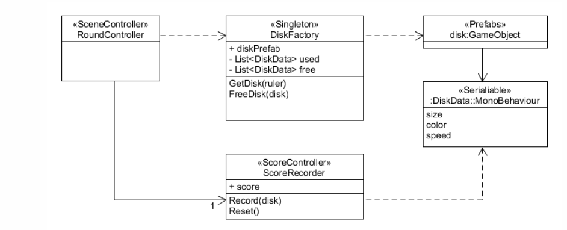
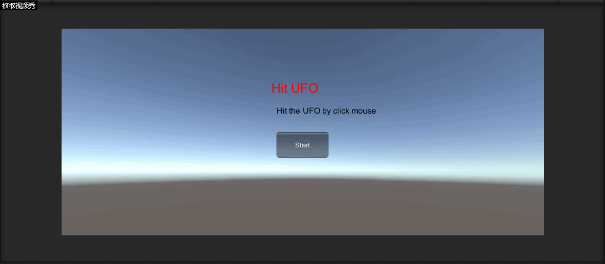

# Homework5-编写一个简单的鼠标打飞碟(Hit UFO)游戏

## 游戏内容

* 游戏有 n 个 round，每个 round 都包括10 次 trial
* 每个 trial 的飞碟的色彩、大小、发射位置、速度、角度、同时出现的个数都可能不同。它们由该 round 的 ruler 控制
* 每个 trial 的飞碟有随机性，总体难度随 round 上升
* 鼠标点中得分，得分规则按色彩、大小、速度不同计算，规则可自由设定

## 游戏要求

* 使用带缓存的工厂模式管理不同飞碟的生产与回收，该工厂必须是场景单实例的！具体实现见参考资源 Singleton 模板类
* 尽可能使用前面MVC结构实现人机交互与游戏模型分离

## 游戏设计

游戏架构组成：
* 导演
* 场记
* 运动管理器
* 记分员
* 飞碟工厂

这些游戏结构之间的联系是：



它们遵循着以下调用关系：
* 飞碟工厂管理飞碟的发放与回收，自己有个小仓库管理这些飞碟
* 记分员按飞碟的数据计分，记分员拥有计分规则
* 场记只需要管理出飞碟规则与管理碰撞就可以了

根据这些关系我们便可以构建出整个游戏的框架

### 导演

导演的工作是管理游戏场景，但是在这个游戏中只有一个游戏场景，因此只需要简单地定义构造函数便可以

```
using System.Collections;
using System.Collections.Generic;
using UnityEngine;

public class SSDirector : System.Object {
    private static SSDirector _instance;

    public ISceneController CurrentScenceController { get; set; }

    public static SSDirector GetInstance() {
        if (_instance == null) {
            _instance = new SSDirector();
        }
        return _instance;
    }
}

```

### 场记

场记的工作是管理游戏的规则，也就是根据游戏的规则将各个部分的工作统筹起来，在该游戏中场记需要完成各游戏结构的初始化、游戏资源的加载以及何时对飞碟进行回收和发送

```
using System.Collections;
using System.Collections.Generic;
using UnityEngine;

public class FirstController : MonoBehaviour, ISceneController, IUserAction {
    public FlyActionManager action_manager;
    public DiskFactory disk_factory;
    public UserGUI user_gui;
    public ScoreRecorder score_recorder;
    private int round = 1;                                                  
    private int trial = 0;
    //private float speed = 1f;                                             
    private bool running = false;

    void Start () {
        SSDirector director = SSDirector.GetInstance();     
        director.CurrentScenceController = this;
        disk_factory = Singleton<DiskFactory>.Instance;
        score_recorder = Singleton<ScoreRecorder>.Instance;
        action_manager = gameObject.AddComponent<FlyActionManager>() as FlyActionManager;
        user_gui = gameObject.AddComponent<UserGUI>() as UserGUI;
    }

    int count = 0;
	void Update () {
        if(running) {
            count++;
            if (Input.GetButtonDown("Fire1")) {
                Vector3 pos = Input.mousePosition;
                Hit(pos);
            }
            switch (round) {
                case 1: {
                        if (count >= 150) {
                            count = 0;
                            SendDisk(1);
                            trial += 1;
                            if (trial == 10) {
                                round += 1;
                                trial = 0;
                            }
                        }
                        break;
                    }
                case 2: {
                        if (count >= 100) {
                            count = 0;
                            if (trial % 2 == 0) SendDisk(1);
                            else SendDisk(2);
                            trial += 1;
                            if (trial == 10) {
                                round += 1;
                                trial = 0;
                            }
                        }
                        break;
                    }
                case 3: {
                        if (count >= 50) {
                            count = 0;
                            if (trial % 3 == 0) SendDisk(1);
                            else if(trial % 3 == 1) SendDisk(2);
                            else SendDisk(3);
                            trial += 1;
                            if (trial == 10) {
                                running = false;
                            }
                        }
                        break;
                    }
                default:break;
            } 
            disk_factory.FreeDisk();
        }
    }

    public void LoadResources() {
        disk_factory.GetDisk(round);
        disk_factory.FreeDisk();
    }

    private void SendDisk(int type) {
        //从工厂中拿一个飞碟
        GameObject disk = disk_factory.GetDisk(type);

        //飞碟位置
        float ran_y = 0;
        float ran_x = Random.Range(-1f, 1f) < 0 ? -1 : 1;
 
        //飞碟初始所受的力和角度
        float power = 0;
        float angle = 0;
        if (type == 1) {
            ran_y = Random.Range(1f, 5f);
            power = Random.Range(5f, 7f);
            angle = Random.Range(25f,30f);
        }
        else if (type == 2) {
            ran_y = Random.Range(2f, 3f);
            power = Random.Range(10f, 12f);
            angle = Random.Range(15f, 17f);
        }
        else {
            ran_y = Random.Range(5f, 6f);
            power = Random.Range(15f, 20f);
            angle = Random.Range(10f, 12f);
        }
        disk.transform.position = new Vector3(ran_x*16f, ran_y, 0);
        action_manager.DiskFly(disk, angle, power);
    }

    public void Hit(Vector3 pos) {
        Ray ray = Camera.main.ScreenPointToRay(pos);
        RaycastHit[] hits;
        hits = Physics.RaycastAll(ray);
        for (int i = 0; i < hits.Length; i++) {
            RaycastHit hit = hits[i];
            if (hit.collider.gameObject.GetComponent<Disk>() != null) {
                score_recorder.Record(hit.collider.gameObject);
                hit.collider.gameObject.transform.position = new Vector3(0, -10, 0);
            }
        }
    }

    public float GetScore() {
        return score_recorder.GetScore();
    }

    public int GetRound() {
        return round;
    }

    public int GetTrial() {
        return trial;
    }

    //重新开始
    public void ReStart() {
        running = true;
        score_recorder.Reset();
        disk_factory.Reset();
        round = 1;
        trial = 1;
        //speed = 2f;
    }
    //游戏结束
    public void GameOver() {
        running = false;
    }
}

```

### 运动管理器

运动管理器定义了飞碟运动的轨迹以及方式，是在HW4中的组合动作基类的基础上定义的动作

```
using System.Collections;
using System.Collections.Generic;
using UnityEngine;
// 模拟飞行
public class DiskFlyAction : SSAction {
    public float gravity = -1;                                 //向下的加速度
    private Vector3 start_vector;                              //初速度向量
    private Vector3 gravity_vector = Vector3.zero;             //加速度的向量，初始时为0
    private Vector3 current_angle = Vector3.zero;              //当前时间的欧拉角
    private float time;                                        //已经过去的时间

    private DiskFlyAction() { }
    public static DiskFlyAction GetSSAction(int lor, float angle, float power) {
        //初始化物体将要运动的初速度向量
        DiskFlyAction action = CreateInstance<DiskFlyAction>();
        if (lor == -1) {
            action.start_vector = Quaternion.Euler(new Vector3(0, 0, -angle)) * Vector3.left * power;
        }
        else {
            action.start_vector = Quaternion.Euler(new Vector3(0, 0, angle)) * Vector3.right * power;
        }
        return action;
    }

    public override void Update() {
        //计算物体的向下的速度,v=at
        time += Time.fixedDeltaTime;
        gravity_vector.y = gravity * time;

        //位移模拟
        transform.position += (start_vector + gravity_vector) * Time.fixedDeltaTime;
        current_angle.z = Mathf.Atan((start_vector.y + gravity_vector.y) / start_vector.x) * Mathf.Rad2Deg;
        transform.eulerAngles = current_angle;

        //如果物体y坐标小于-10，动作就做完了
        if (this.transform.position.y < -10) {
            this.destroy = true;
            this.callback.SSActionEvent(this);      
        }
    }

    public override void Start() { }
}

```

### 记分员

记分员的工作就只是简单地提供Record、GetScore和Reset3个类方法，只需要将得分保存下来就可以了。如何加分、何时加分的逻辑在场记中已经完成了

```
using System.Collections;
using System.Collections.Generic;
using UnityEngine;
public class ScoreRecorder : MonoBehaviour {
    private float score;
    void Start () {
        score = 0;
    }
    public void Record(GameObject disk) {
        score += disk.GetComponent<Disk>().score;
    }
    public float GetScore() {
        return score;
    }
    public void Reset() {
        score = 0;
    }
}

```

### 飞碟工厂

顾名思义，飞碟工厂的工作便是对飞碟进行发送和回收，在这里可以用两个列表used和free来保存飞碟对象，并且通过`GetDisk`和`FreeDisk`来实现对象池

```
using System.Collections;
using System.Collections.Generic;
using UnityEngine;
// 工厂
public class DiskFactory : MonoBehaviour {
    private List<Disk> used = new List<Disk>();
    private List<Disk> free = new List<Disk>();

    public GameObject GetDisk(int type) {
        GameObject disk_prefab = null;
        //寻找空闲飞碟,如果无空闲飞碟则重新实例化飞碟
        if (free.Count>0) {
            for(int i = 0; i < free.Count; i++) {
                if (free[i].type == type) {
                    disk_prefab = free[i].gameObject;
                    free.Remove(free[i]);
                    break;
                }
            }     
        }

        if(disk_prefab == null) {
            if(type == 1) {
                disk_prefab = Instantiate(
                Resources.Load<GameObject>("Prefabs/disk1"),
                new Vector3(0, -10f, 0), Quaternion.identity);
            }
            else if (type == 2) {
                disk_prefab = Instantiate(
                Resources.Load<GameObject>("Prefabs/disk2"),
                new Vector3(0, -10f, 0), Quaternion.identity);
            }
            else {
                disk_prefab = Instantiate(
                Resources.Load<GameObject>("Prefabs/disk3"),
                new Vector3(0, -10f, 0), Quaternion.identity);
            }

            disk_prefab.GetComponent<Renderer>().material.color = disk_prefab.GetComponent<Disk>().color;
        }

        used.Add(disk_prefab.GetComponent<Disk>());
        disk_prefab.SetActive(true);
        return disk_prefab;
    }

    public void FreeDisk() {
        for(int i=0; i<used.Count; i++) {
            if (used[i].gameObject.transform.position.y <= -10f) {
                free.Add(used[i]);
                used.Remove(used[i]);
            }
        }          
    }

    public void Reset() {
        FreeDisk();
    }

}

```

## 游戏视频



## 项目运行

将Assets替代你自己的Assets，并将Scene中的UFOScreen拖到左边栏中，然后点击运行


