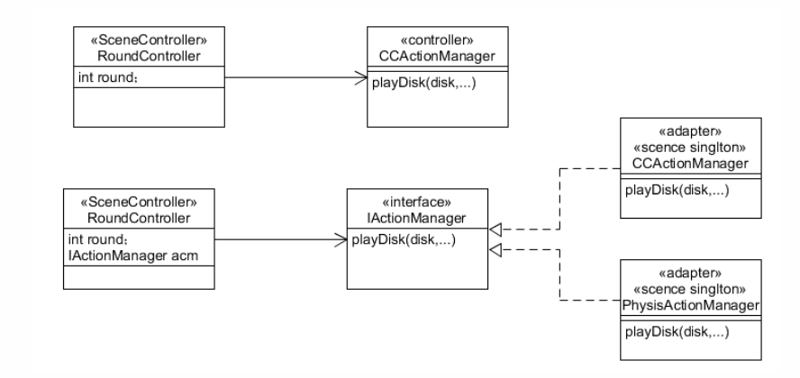
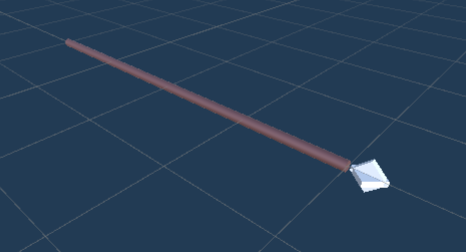
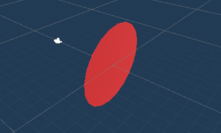
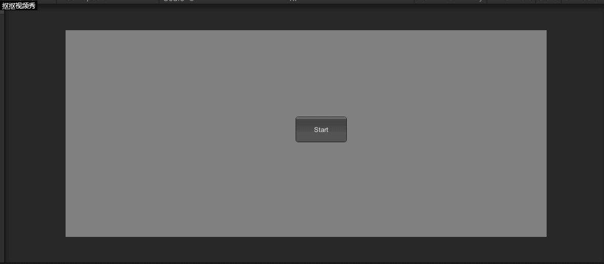
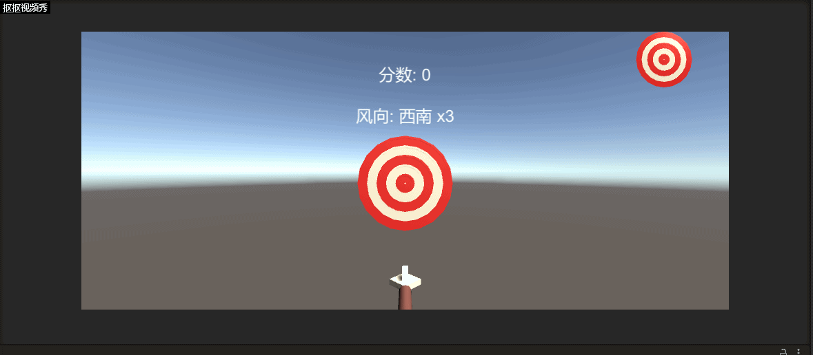

# Homework6-物理系统与碰撞

## 改进飞碟(Hit UFO)游戏

### 游戏内容要求

* 按adapter模式设计图修改飞碟游戏
* 按它同时支持物理运动与运动学（变换）云顶

### 游戏设计

#### 适配器模式

首先来了解一下适配器模式：
* 适配器模式的定义为：将一个类的接口转换成客户希望的另一个接口。adapter模式使得原来由于接口不兼容而不能在一起的那些类可以一起工作
* 从程序的角度来讲，就是原本互不兼容，无法一起工作的接口，通过“适配器”，可以让两个接口兼容起来，并能够一起工作。
* 应用场景为，当出现一个不符合客户端接口的情况时，在不想破坏接口的前提下，就必须设计一个适配器来进行转换，将原本不符合的接口，转换到客户端预期的接口上

新的设计模式如下：



而在这次作业中使用适配器模式的动机是，我们需要在FirstController里面调用飞碟的Action方法，也就是DiskFlyAction的方法，但是如果我们需要设计不同物体的运动方式，比如说不是飞碟而是飞机的运动方式，并且同一时间需要同时对两种不同的运动方式进行管理，那么一种很直观的方法是在FirstController中使用条件判别语句来对两种不同运动方式进行分开处理，但这样子明显代码很冗余并且维护性也差，因此一种比较好的方式是使用一个适配器，对两种不同的运动方式进行统一管理，也就是我们在FirstController中只提供一种运动组合类FlyAction，然后在FlyAction类对两种不同的运动方式进行管理，这样子我们要增加新的运动方式的时候，也只需要改变FlyAction类

#### FirstController实现

```
using System.Collections;
using System.Collections.Generic;
using UnityEngine;


public class FirstController : MonoBehaviour, ISceneController, IUserAction
{
    public FlyActionManager action_manager;
    public DiskFactory disk_factory;
    public UserGUI user_gui;

    private Queue<GameObject> disk_queue = new Queue<GameObject>();          //飞碟队列
    private List<GameObject> disk_notshot = new List<GameObject>();          //没有被打中的飞碟队列
    private int round = 1;                                                   
    private float speed = 2f;                                                //发射时间间隔
    private bool playing_game = false;                                       
    private bool game_over = false;                                          
    private bool game_start = false;                                        
    private int score_round2 = 10;                                           
    private int score_round3 = 20;                                          

    void Start()
    {
        SSDirector director = SSDirector.GetInstance();
        director.CurrentScenceController = this;
        disk_factory = Singleton<DiskFactory>.Instance;
        action_manager = gameObject.AddComponent<FlyActionManager>() as FlyActionManager;
        user_gui = gameObject.AddComponent<UserGUI>() as UserGUI;
    }

    void Update()
    {
        if (game_start)
        {
            if (game_over)
            {
                CancelInvoke("LoadResources");
            }
            if (!playing_game)
            {
                InvokeRepeating("LoadResources", 1f, speed);
                playing_game = true;
            }
            SendDisk();
            if (user_gui.score >= score_round2 && round == 1)
            {
                round = 2;
                speed = speed - 0.6f;
                CancelInvoke("LoadResources");
                playing_game = false;
            }
            else if (user_gui.score >= score_round3 && round == 2)
            {
                round = 3;
                speed = speed - 0.5f;
                CancelInvoke("LoadResources");
                playing_game = false;
            }
        }
    }

    public void LoadResources()
    {
        disk_queue.Enqueue(disk_factory.GetDisk(round));
    }

    private void SendDisk()
    {
        float position_x = 16;
        if (disk_queue.Count != 0)
        {
            GameObject disk = disk_queue.Dequeue();
            disk_notshot.Add(disk);
            disk.SetActive(true);
            float ran_y = 6;
            float ran_x = Random.Range(-1f, 1f) < 0 ? -1 : 1;
            if (round == 2)
            {
                disk.GetComponent<DiskComponent>().score = 2;
                float diff = Random.Range(1, 5);
                ran_y -= diff;   
            }
            else if(round == 3)
            {
                disk.GetComponent<DiskComponent>().score = 3;
                float diff = Random.Range(6, 9);
                ran_y -= 6;
            }
            disk.GetComponent<DiskComponent>().direction = new Vector3(ran_x, ran_y, 10);
            Vector3 position = new Vector3(-disk.GetComponent<DiskComponent>().direction.x * position_x, ran_y, 15);
            disk.transform.position = position;
            float power = Random.Range(10f, 15f);
            float angle = Random.Range(0, 0);
            bool flag = false;
            action_manager.UFOFly(disk, angle, power, flag);
        }

        for (int i = 0; i < disk_notshot.Count; i++)
        {
            GameObject temp = disk_notshot[i];
            if (temp.transform.position.y < -10 && temp.gameObject.activeSelf == true)
            {
                disk_factory.FreeDisk(disk_notshot[i]);
                disk_notshot.Remove(disk_notshot[i]);
                user_gui.ReduceBlood();
            }
        }
    }

    public void Hit(Vector3 pos)
    {
        Ray ray = Camera.main.ScreenPointToRay(pos);
        RaycastHit[] hits;
        hits = Physics.RaycastAll(ray);
        bool not_hit = false;
        for (int i = 0; i < hits.Length; i++)
        {
            RaycastHit hit = hits[i];
            if (hit.collider.gameObject.GetComponent<DiskComponent>() != null)
            {
                for (int j = 0; j < disk_notshot.Count; j++)
                {
                    if (hit.collider.gameObject.GetInstanceID() == disk_notshot[j].gameObject.GetInstanceID())
                    {
                        not_hit = true;
                    }
                }
                if (!not_hit)
                {
                    return;
                }
                disk_notshot.Remove(hit.collider.gameObject);
                user_gui.Record(hit.collider.gameObject);
                //回收飞碟
                StartCoroutine(WaitingParticle(0.08f, hit, disk_factory, hit.collider.gameObject));
                break;
            }
        }
    }

    public int GetScore()
    {
        return user_gui.score;
    }

    public void ReStart()
    {
        game_over = false;
        playing_game = false;
        user_gui.score = 0;
        round = 1;
        speed = 2f;
    }

    public void GameOver()
    {
        game_over = true;
    }

    IEnumerator WaitingParticle(float wait_time, RaycastHit hit, DiskFactory disk_factory, GameObject obj)
    {
        yield return new WaitForSeconds(wait_time);
        hit.collider.gameObject.transform.position = new Vector3(0, -9, 0);
        disk_factory.FreeDisk(obj);
    }
    public void BeginGame()
    {
        game_start = true;
    }
}
```

我们可以看到在`FirstController.cs`中，只是定义了一个FlyActionManager类，用来统一管理各种不同的飞行动作

```
public FlyActionManager action_manager;
```

然后我们需要执行UFO的飞行动作时，只需要调用这个manager中对应UFO飞行的方法便可：
```
action_manager.UFOFly(disk, angle, power, flag);
```

#### FlyActionManager实现

```
using System.Collections;
using System.Collections.Generic;
using UnityEngine;

public class FlyActionManager : SSActionManager
{

    public DiskFlyAction fly;                            
    public FirstController scene_controller;            

    protected void Start()
    {
        scene_controller = (FirstController)SSDirector.GetInstance().CurrentScenceController;
        scene_controller.action_manager = this;
    }

    //飞行
    public void UFOFly(GameObject disk, float angle, float power, bool flag)
    {
        fly = DiskFlyAction.GetSSAction(disk.GetComponent<DiskComponent>().direction, angle, power,flag);
        this.RunAction(disk, fly, this);
    }
}
```

因为这次游戏只有UFO在飞行，因此这里只有UFOFly一个方法。当我们需要实现其他不同物体的飞行方法时，我们只需要在这里增加对应的类方法

#### DiskFlyAction.cs实现

```
using System.Collections;
using System.Collections.Generic;
using UnityEngine;

public class DiskFlyAction : SSAction
{
    
    public float gravity = -5;                                 
    private Vector3 start_vector;                             
    private Vector3 gravity_vector = Vector3.zero;             
    private float time;                                       
    private Vector3 current_angle = Vector3.zero;

    public static DiskFlyAction GetSSAction(Vector3 direction, float angle, float power, bool flag)
    {
        Vector3 delta_vector = new Vector3(0, -3, 0);
        DiskFlyAction action = CreateInstance<DiskFlyAction>();
        if (flag)
        {
            action.start_vector += delta_vector;
        }
        else
        {
            if (direction.x == -1)
            {
                action.start_vector = Quaternion.Euler(new Vector3(0, 0, -angle)) * Vector3.left * power;
            }
            else
            {
                action.start_vector = Quaternion.Euler(new Vector3(0, 0, angle)) * Vector3.right * power;
            }
        }
        return action;
        }


    public override void Update()
    {
        time += Time.fixedDeltaTime;
        gravity_vector.y = gravity * time;

        transform.position += (start_vector + gravity_vector) * Time.fixedDeltaTime;
        current_angle.z = Mathf.Atan((start_vector.y + gravity_vector.y) / start_vector.x) * Mathf.Rad2Deg;
        transform.eulerAngles = current_angle;

        if (this.transform.position.y < -10)
        {
            this.destroy = true;
            this.callback.SSActionEvent(this);
        }
    }

    public override void Start() { }
}
```

这便是我们之前实现的UFO飞行的动作类方法

#### 物理运动和变换运动实现实现

物理运动是指游戏世界对象赋予现实世界物理属性（重量、形状等），并抽象为刚体（Rigid）模型（也包括滑轮、绳索等），使得游戏物体在力的作用下，仿真现实世界的运动及其之间的碰撞。简而言之，物体在力的作用下运动。

```
public static DiskFlyAction GetSSAction(Vector3 direction, float angle, float power)
{
    DiskFlyAction action = CreateInstance<DiskFlyAction>();
    if (direction.x == -1)
    {
        action.start_vector = Quaternion.Euler(new Vector3(0, 0, -angle)) * Vector3.left * power;
    }
    else
    {
        action.start_vector = Quaternion.Euler(new Vector3(0, 0, angle)) * Vector3.right * power;
    }
    return action;
}

public override void Update()
{
    time += Time.fixedDeltaTime;
    gravity_vector.y = gravity * time;
    transform.position += (start_vector + gravity_vector) * Time.fixedDeltaTime;
    current_angle.z = Mathf.Atan((start_vector.y + gravity_vector.y) / start_vector.x) * Mathf.Rad2Deg;
    transform.eulerAngles = current_angle;
}
```

上述代码可以使得物体在重力的作用下进行运动

变换运动指的是运用几何学的方法来研究物体的运动，通常不考虑力和质量等因素的影响，即游戏对象位置的直接改变，而不是在力的作用下改变

也就是简单的Vector的变化：

```
action.start_vector += delta_vector;
```

## 打靶游戏（可选作业）

### 游戏内容要求

* 靶对象为5环，按环计分
* 箭对象，射中后要插在靶上
  * 增强要求：射中后，箭对象产生颤抖对象，到下一次射击后1秒以后
* 游戏仅1轮，无限trials
  * 增强要求：添加一个风向和强度标志，提高难度

### 游戏设计

#### 制作预制

预制用的都是一位师兄做的现成的预制：





#### 弓箭工厂实现

与飞碟工厂一样，也需要一个弓箭工厂来实现弓箭的分发和回收，其实现过程与飞碟工厂的实现方法大同小异：
```
using Scene;
using System;
using System.Collections;
using System.Collections.Generic;
using UnityEngine;

public class ArrowFactory : System.Object
{
    private static ArrowFactory instance;
    private GameObject ArrowPrefabs;
    private List<GameObject> usingArrowList = new List<GameObject>();
    private List<GameObject> freeArrowList = new List<GameObject>();
    private Vector3 INITIAL_POS = new Vector3(0, 0, -19);

    public static ArrowFactory getInstance()
    {
        if (instance == null) instance = new ArrowFactory();
        return instance;
    }

    public void init(GameObject _arrowPrefabs)
    {
        ArrowPrefabs = _arrowPrefabs;
    }

    internal void detectArrowsReuse()
    {
       for(int i = 0; i < usingArrowList.Count; i++)
        {
            if(usingArrowList[i].transform.position.y <= -8)
            {
                usingArrowList[i].GetComponent<Rigidbody>().isKinematic = true;
                usingArrowList[i].SetActive(false);
                usingArrowList[i].transform.position = INITIAL_POS;
                freeArrowList.Add(usingArrowList[i]);
                usingArrowList.Remove(usingArrowList[i]);
                i--;
                SceneController.getInstance().changeWind();
            }
        } 
    }

    internal GameObject getArrow()
    {
        if(freeArrowList.Count == 0)
        {
            GameObject newArrow = Camera.Instantiate(ArrowPrefabs);
            usingArrowList.Add(newArrow);
            return newArrow;
        }
        else
        {
            GameObject oldArrow = freeArrowList[0];
            freeArrowList.RemoveAt(0);
            oldArrow.SetActive(true);
            usingArrowList.Add(oldArrow);
            return oldArrow;
        }
    }
}

```

##### 弓箭控制类

需要实现一个弓箭控制类来完成弓箭在风力的作用下动作的变化：

```
using Scene;
using System;
using System.Collections;
using System.Collections.Generic;
using UnityEngine;

public class ArrowController : MonoBehaviour {

    public GameObject TargetPrefabs, ArrowPrefabs;

    private GameObject holdingArrow, target;
    private const int SPEED = 40;
    private SceneController scene;
    private Vector3[] winds = new Vector3[8]
    {
        new Vector3(0, 1, 0), new Vector3(1,1,0), new Vector3(1,0,0), new Vector3(1,-1,0), new Vector3(0,-1,0), new Vector3(-1,-1,0), new Vector3(-1,0,0), new Vector3(-1,1,0)
    };

    private void Awake()
    {
        ArrowFactory.getInstance().init(ArrowPrefabs);
    }

    // Use this for initialization
    void Start () {
        scene = SceneController.getInstance();
        scene.setArrowController(this);
        target = Instantiate(TargetPrefabs);
	}
	
	// Update is called once per frame
	void Update () {
        ArrowFactory.getInstance().detectArrowsReuse();
	}

    public bool ifReadyToShoot()
    {
        return (holdingArrow != null);
    }

    internal void getArrow()
    {
        if (holdingArrow == null) holdingArrow = ArrowFactory.getInstance().getArrow();
    }

    internal void shootArrow(Vector3 mousePos)
    {
        holdingArrow.transform.LookAt(mousePos * 30);
        holdingArrow.GetComponent<Rigidbody>().isKinematic = false;
        addWind();  //箭在射出过程中会持续受到一个风力
        holdingArrow.GetComponent<Rigidbody>().AddForce(mousePos * 30, ForceMode.Impulse);
        holdingArrow = null;
    }

    private void addWind()
    {
        int windDir = scene.getWindDirection();
        int windStrength = scene.getWindStrength();
        Vector3 windForce = winds[windDir]*50;
        holdingArrow.GetComponent<Rigidbody>().AddForce(windForce, ForceMode.Force);
    }
}

```

##### 记分员

记分员的工作是管理游戏的状态和根据游戏的状态来记录分数

```
using Scene;
using System;
using System.Collections;
using System.Collections.Generic;
using UnityEngine;
using UnityEngine.UI;

public class GameStateController : MonoBehaviour {
    public int i = 0;
    public GameObject canvasPrefabs, scoreTextPrefabs, tipsTextPrefabs, windTextPrefabs;
    private int score = 0, windDir = 0, windStrength = 0;

    private const float TIPS_SHOW_TIME = 0.5f;

    private GameObject canvas, scoreText, tipsText, windText;
    private SceneController scene;
    private string[] windDirectionArray;

    // Use this for initialization
    void Start () {
        scene = SceneController.getInstance();
        scene.setGameController(this);
        canvas = Instantiate(canvasPrefabs);
        scoreText = Instantiate(scoreTextPrefabs, canvas.transform);
        tipsText = Instantiate(tipsTextPrefabs, canvas.transform);
        windText = Instantiate(windTextPrefabs, canvas.transform);

        scoreText.GetComponent<Text>().text = "分数: " + score;
        tipsText.SetActive(false);
        windDirectionArray = new string[8] { "北", "东北", "东", "东南", "南", "西南", "西", "西北" };
        changeWind();
    }

    public void changeWind()
    {
        windDir = UnityEngine.Random.Range(0,8);
        windStrength = UnityEngine.Random.Range(0, 8);
        windText.GetComponent<Text>().text = "风向: " + windDirectionArray[windDir] + " x" + windStrength;
    }

    internal void addScore(int point)
    {
        i++;
        if(i%2==0)
            score += point;
        scoreText.GetComponent<Text>().text = "分数: " + score;
        changeWind();
    }

    // Update is called once per frame
    void Update () {
		
	}

    internal int getWindDirec()
    {
        return windDir;
    }

    internal int getWindStrength()
    {
        return windStrength;
    }

    //提示命中环数
    internal void showTips(int point)
    {
        tipsText.GetComponent<Text>().text = point + " Points!\n";
        switch (point)
        {
            case 1:
                tipsText.GetComponent<Text>().text += "Poor!";
                break;
            case 2:
                tipsText.GetComponent<Text>().text += "Fair!";
                break;
            case 3:
                tipsText.GetComponent<Text>().text += "Average!";
                break;
            case 4:
                tipsText.GetComponent<Text>().text += "Good!";
                break;
            case 5:
                tipsText.GetComponent<Text>().text += "Excellent!";
                break;

        }
        tipsText.SetActive(true);
        StartCoroutine(waitForTipsDisappear());
    }

    private IEnumerator waitForTipsDisappear()
    {
        yield return new WaitForSeconds(TIPS_SHOW_TIME);
        tipsText.SetActive(false);
    }
}

```

##### 场记

实现场景的管理

```
using System.Collections;
using System.Collections.Generic;
using UnityEngine;

namespace Scene
{
    public interface IUserAction
    {
        void getArrow();
        void shootArrow(Vector3 mousePos);
    }

    public interface ISceneController
    {
        void addScore(int point);
        void showTips(int point);
        void changeWind();
        int getWindDirection();
        int getWindStrength();
        bool ifReadyToShoot();
    }

    public class SceneController : System.Object, IUserAction, ISceneController
    {
        private static SceneController instance;
        private GameStateController gameStateController;
        private ArrowController arrowController;

        public static SceneController getInstance()
        {
            if (instance == null) instance = new SceneController();
            return instance;
        }

        public void setGameController(GameStateController gsc)
        {
            gameStateController = gsc;
        }

        public void setArrowController(ArrowController _arrowController)
        {
            arrowController = _arrowController;
        }

        public void addScore(int point)
        {
            gameStateController.addScore(point);
        }

        public void changeWind()
        {
            gameStateController.changeWind();
        }

        public void getArrow()
        {
            arrowController.getArrow();
        }

        public int getWindDirection()
        {
            return gameStateController.getWindDirec();
        }

        public int getWindStrength()
        {
            return gameStateController.getWindStrength();
        }

        public bool ifReadyToShoot()
        {
            return arrowController.ifReadyToShoot();
        }

        public void shootArrow(Vector3 mousePos)
        {
            arrowController.shootArrow(mousePos);
        }

        public void showTips(int point)
        {
            gameStateController.showTips(point);
        }
    }

}
```

##### 碰撞检测类

完成的工作是根据碰撞的事件来处理不同的回调函数，直观上控制的是箭击中靶后得到的分数

```
using Scene;
using System.Collections;
using System.Collections.Generic;
using UnityEngine;

public class ArrowCollider : MonoBehaviour {
    private ISceneController scene;

    void Start () {
        scene = SceneController.getInstance() as ISceneController;
	}
	
	void Update () {

	}

    void OnTriggerEnter(Collider other)
    {
        if (other.gameObject.tag == "target")
        {
            gameObject.transform.parent.gameObject.GetComponent<Rigidbody>().isKinematic = true;
            gameObject.SetActive(false);
            int points = other.gameObject.name[other.gameObject.name.Length - 1] - '0';
            scene.addScore(points);
            scene.showTips(points);
            
        }
    }
}

```

## 运行视频

### Game1



### Game2



## 运行项目

将Assets文件代替您自己的Assets文件，然后将screen中的Demo拖进左侧任务栏中点击运行便可以


