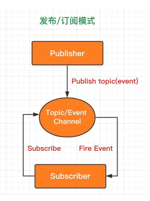

# Homework7-智能巡逻兵

## 项目要求

* 游戏设计要求：
  * 创建一个地图和若干巡逻兵(使用动画)
  * 每个巡逻兵走一个3~5个边的凸多边型，位置数据是相对地址。即每次确定下一个目标位置，用自己当前位置为原点计算
  * 巡逻兵碰撞到障碍物，则会自动选下一个点为目标
  * 巡逻兵在设定范围内感知到玩家，会自动追击玩家
  * 失去玩家目标后，继续巡逻
  * 计分：玩家每次甩掉一个巡逻兵计一分，与巡逻兵碰撞游戏结束
* 程序设计要求
  * 必须使用订阅与发布模式传消息
    * subject：OnLostGoal
    * Publisher: ?
    * Subscriber：？
  * 工厂模式生产巡逻兵
* 友善提示1：生成 3~5个边的凸多边型
  * 随机生成矩形
  * 在矩形每个边上随机找点，可得到 3 - 4 的凸多边型
  * 5 ?
* 友善提示2：参考以前博客，给出自己新玩法

## 游戏玩法和规则

玩家操纵hero躲避巡逻兵的追捕，然后去挖取随机分布在地图上的矿石，当采集完矿石的时候玩家胜利，在这之前玩家被巡逻兵追捕到则玩家失败

## 游戏效果展示

## 2D地图和Sprite预制件制作

## 脚本编写

### 设计模式

在本次作业中我们使用的设计模式是发布/订阅模式，我们先来看一下发布/订阅模式的实现结构：



发布订阅模式相比观察者模式多了个事件通道，事件通道作为调度中心，管理事件的订阅和发布工作，彻底隔绝了订阅者和发布者的依赖关系。即订阅者在订阅事件的时候，只关注事件本身，而不关心谁会发布这个事件；发布者在发布事件的时候，只关注事件本身，而不关心谁订阅了这个事件

我们在编写游戏脚本的时候，这个设计模式是非常有用的，例如我们设计hero在进入巡逻兵的追捕范围的时候，我们想要巡逻兵发起对hero的追捕，我们如何来实现这个逻辑？如果我们用订阅发布者模式来实现的话，我们只需要一个事件管理器，然后在hero进入巡逻兵的追捕范围的时候，这个一般由巡逻兵的碰撞Trigger来检测到，那么它便会把这个消息发布出来，也就是将信息发布到事件管理器，而巡逻兵工厂是订阅了这个事件的，因此它受到了这个信息，就会指派那个巡逻兵去追捕hero

我们使用订阅发布者模式来实现游戏的逻辑就会方便很多


### 时间管理器

时间管理器相当于一个报刊，发布者将信息发布到这里来，然后报刊将信息发送给所有订阅者，代码实现如下：

```
using System.Collections;
using System.Collections.Generic;
using UnityEngine;

public class EventManager : MonoBehaviour
{
    public delegate void GameOverEvent(bool win);
    public static event GameOverEvent GameOverChange;
    public delegate void StartCatchingEvent(int id, GameObject hero);
    public static event StartCatchingEvent StartCatchingChange;
    public delegate void StopCatchingEvent(int id);
    public static event StopCatchingEvent StopCatchingChange;
    public delegate void SwitchEvent(int id);
    public static event SwitchEvent PatrolSwitchChange;
    public delegate void ContinuePatrolEvent(int id);
    public static event ContinuePatrolEvent ContinuePatrolChange;
    public delegate void CollectRockEvent(int id);
    public static event CollectRockEvent CollectRockChange;

    public void HeroCaughted()
    {
        if(GameOverChange != null)
        {
            GameOverChange(false);
        }
    }

    public void CollectAllRocks()
    {
        if (GameOverChange != null)
        {
            GameOverChange(true);
        }
    }

    public void CatchingHero(int id, GameObject hero)
    {
        if (StartCatchingChange != null)
        {
            StartCatchingChange(id, hero);
        }
    }

    public void StopCatching(int id)
    {
        if (StopCatchingChange != null)
        {
            StopCatchingChange(id);
        }
    }

    public void PatrolSwicth(int id)
    {
        if(PatrolSwitchChange != null)
        {
            PatrolSwitchChange(id);
        }
    }

    public void ContinuePatrol(int id)
    {
        if(ContinuePatrolChange != null)
        {
            ContinuePatrolChange(id);
        }
    }

    public void CollectRock(int id)
    {
        if(CollectRockChange != null)
        {
            
            CollectRockChange(id);
        }
    }
}

```

这里定义了6个事件：
* GameOverEvent 游戏结束事件
* StartCatchingEvent 巡逻兵开始追捕事件
* StopCatchingEvent 巡逻兵结束追捕事件
* SwitchEvent 巡逻兵转换方向事件
* ContinuePatrolEvent 巡逻兵继续巡逻事件
* CollectRockEvent 矿石被挖事件

这里面用代理的方式来实现“报刊发送消息到订阅者”这一逻辑，以GameOverEvent事件为例：

```
public delegate void GameOverEvent(bool win);
public static event GameOverEvent GameOverChange;
```

需要订阅该事件的是FirstController，因为场记是实现游戏规则逻辑的，注册事件的代码为：

```
void OnEnable()
{
    EventManager.GameOverChange += GameOver;
        
}
```

也就是所有，实现了GameOverEvent函数签名的方法都可以进行注册，GameOver函数的定义为：

```
void GameOver(bool win)
{
    if (win)
    {
        status = Status.Win;
        DestroyAll();
        Debug.Log("You win");
    }
    else
    {
        status = Status.Loss;
        DestroyAll();
        Debug.Log("You loss");
    }
}
```

只是简单地根据传入的win布尔变量来判断游戏结果并进行相应状态的设置

这样子当时间管理器调用了`GameOverChange()`之后，所有注册了该事件的函数都会被调用

“报刊发送信息给订阅者”的逻辑已经实现了，接下来需要实现的是“发布者发布消息到报刊这一逻辑”，我们只需要在事件管理器中简单定义一个公有方法：

```
public void HeroCaughted()
{
    if(GameOverChange != null)
    {
        GameOverChange(false);
    }
}
```

例如如果巡逻兵与hero发生了碰撞（由碰撞体进行检测），只需要调用EventManager.HeroCaughted()便可以了，EventManager调用了GameOverChange之后，所有注册了GameOverEvnet的方法都会被调用

### 碰撞体检测

我们的很多出逻辑都需要检测碰撞，例如玩家与巡逻兵进行碰撞之后需要向事件管理器发布消息，玩家进入巡逻兵的检测范围内也需要向事件管理器发布消息，玩家与矿石碰撞也需要向事件管理器发布消息....

碰撞体检测也分两种，一种是直接刚体碰撞，另外一种是Trigger方式的碰撞，前者是两个碰撞体不会有重叠的部分，后者是两个碰撞体可以是重叠的部分，会维护一个Trigger变量，当两者碰撞的时候Trigger变量便为true，否则为false，因此我们可以用直接刚体碰撞来实现“hero被捕”的逻辑，用Trigger碰撞来实现“hero进入巡逻兵追捕范围”的逻辑

以巡逻兵的碰撞体为例：

直接刚体碰撞用的是`OnCollisionEnter2D`方法，当巡逻兵与hero发生刚体碰撞时发布“hero被捕”消息，当与其他障碍物发生碰撞的时候发布“巡逻兵转向”消息

```
private void OnCollisionEnter2D(Collision2D collision)
{
    
    if (collision.gameObject.tag == "Player")
    {
        Singleton<EventManager>.Instance.HeroCaughted();
    }
    else
    {
        Singleton<EventManager>.Instance.PatrolSwicth(this.gameObject.GetComponent<PatrolData>().ID);
    }
}
```

PS:这里面可以用`Singleton<EventManager>.Instance.Func()`的方式来调用EventManager的公有方法

Trigger检测碰撞用的时`OnTriggerEnter2D`方法，该碰撞体的范围可以设置为巡逻兵的巡逻范围，那么当hero走进巡逻范围的时候便会发布“巡逻兵追捕玩家”消息，hero走出巡逻范围便会发布“巡逻兵停止追捕”消息，实现代码如下：

```
private void OnTriggerEnter2D(Collider2D collider)
{
    if(collider.gameObject.tag == "Player")
    {
        Singleton<EventManager>.Instance.CatchingHero(this.gameObject.GetComponent<PatrolData>().ID, collider.gameObject);
    }
    
}

private void OnTriggerExit2D(Collider2D collision)
{
    if(collision.gameObject.tag == "Player")
    {
        Singleton<EventManager>.Instance.StopCatching(this.gameObject.GetComponent<PatrolData>().ID);
    }        
}

```

### 巡逻兵工厂

巡逻兵工厂的功能有以下几点：
* 控制巡逻兵的产生和回收
* 控制巡逻兵的动作和动画

因为保存巡逻兵对象的Dictionary写在了巡逻兵工厂类中，因此与巡逻兵有关的逻辑干脆就都在这里实现了：

产生巡逻兵：

```
void createPatrol()
{
    GameObject patrol = Instantiate(Resources.Load<GameObject>("prefabs/patrol"));
    float minX = 0, minY = 0, maxX = 0, maxY = 0;
    
    if(max_id == 0)//左上角区域
    {
        
        
        minX = -1.7f;
        maxX = -0.5f;
        minY = 0.2f;
        maxY = 1.8f;
    }
    else if(max_id == 1)//右上角区域
    {

        minX = 0.1f;
        maxX = 1.1f;
        minY = 0.3f;
        maxY = 1.8f;
    }
    else if(max_id == 2)//左下角区域
    {
        
        minX = -3.0f;
        maxX = -2.6f;
        minY = -2.4f;
        maxY = -0.47f;
    }
    else//右下角区域
    {
        
        minX = -0.11f;
        maxX = 1.1f;
        minY = -2.4f;
        maxY = -0.47f;
    }
    float randX = Random.Range(minX, maxX);
    float randY = Random.Range(minY, maxY);
    patrol.transform.position = new Vector2(randX, randY);

    patrol.GetComponent<PatrolData>().Area_min_x = minX;
    patrol.GetComponent<PatrolData>().Area_max_x = maxX;
    patrol.GetComponent<PatrolData>().Area_min_y = minY;
    patrol.GetComponent<PatrolData>().Area_max_y = maxY;

    patrol.GetComponent<PatrolData>().ID = max_id;
    patrol.GetComponent<PatrolData>().active = false;

    GoPatrolAction action = GoPatrolAction.GetAction(0.3f);
    action_manager.RunAction(patrol, action, this.action_manager);

    patrols[max_id] = patrol;
    max_id += 1;
}
```

我将整个地图分为4个部分，然后每一个巡逻兵负责一个区域的巡逻任务，然后每个巡逻兵都会在自己负责的那块区域随机出现，并设置巡逻兵的ID，然后根据ID将其放入一个Hash中方便我们后续寻找

然后我们还需要在游戏结束的时候将所有的东西都释放掉它占用的内存：

```
public void DestroyAll()
{
    for (int i = 0; i < max_id; i++)
    {
        GameObject patrol = patrols[i];
        if (patrol != null)
        {
            Destroy(patrol);
        }
    }
    action_manager.DestroyAll();
}
```

在上文很多地方也说了，我们需要注册一些订阅的事件：

```
EventManager.StartCatchingChange += startCatching;
EventManager.StopCatchingChange += stopCatching;
```

也就是EventManager.EventManager.StartCatchingChange函数被调用的时候，会自动调用PatrolFactory.startCatching函数：

```
private void startCatching(int id, GameObject hero)
{
    PatrolFollowAction action = PatrolFollowAction.GetAction(hero, 0.3f);
    patrols[id].GetComponent<PatrolData>().active = true;
    action_manager.RunAction(patrols[id], action, this.action_manager);
    //Debug.Log(id);
}
```

在这里我们将一个动作绑定到具体的某个巡逻兵对象上，并让动作管理器去执行它：

### 追捕动作

巡逻兵追捕动作便是在hero进入巡逻兵的追捕范围之内发生动作，巡逻兵需要在每一帧都向hero的位置进行移动：

```
public override void Update()
{
    this.transform.position = Vector2.MoveTowards(this.transform.position, target.transform.position, speed * Time.deltaTime);
    if((Vector2)this.transform.position == (Vector2)target.transform.position || !isActive())
    {
        this.destroy = true;
        this.callback.SSActionEvent(this);
    }
}
```

因此需要将hero的GameObject传进来，以便实时获取信息

### 巡逻动作

巡逻兵巡逻动作是在巡逻范围内没有hero时候，持续进行的巡逻动作，在这里实现的巡逻逻辑是：某个时刻向巡逻区域所形成的矩形的某条边的随机一个点移动，当碰到障碍物时便会发布“需要转向”信息，然后便会向下一条边上的随机一个点移动，当hero进入追捕范围的时候，结束当前巡逻动作并开始追捕动作，当hero退出巡逻范围的时候，结束追捕动作继续巡逻，这些都是通过发布消息来玩完成

```
public override void Update()
{
    this.transform.position = Vector2.MoveTowards(this.transform.position, target, speed * Time.deltaTime);
    if (outOfBounds())
    {
        SwitchDiection(data.ID);
    }
    if ((Vector2)this.transform.position == target || isActive())
    {
        this.destroy = true;
        this.callback.SSActionEvent(this, SSActionEventType.Competeted, 1, null);
    }
}
```

在这里有一个全局变量target，也就是巡逻兵的目的地，当碰到障碍物或者超过巡逻范围的时候，需要转向：

```
public void SwitchDiection(int id)
{
    if(data.ID == id)
    {
        if(direction == targetSide.A)
        {
            direction = targetSide.W;
        }
        else
        {
            direction += 1;
        }
        target = getTarget(direction);
    }
}
```

在这里该动作类充当一个订阅者的角色，消息源是在碰撞体上：

```
private void OnCollisionEnter2D(Collision2D collision)
{
    
    if (collision.gameObject.tag == "Player")
    {
        Singleton<EventManager>.Instance.HeroCaughted();
    }
    else
    {
        Singleton<EventManager>.Instance.PatrolSwicth(this.gameObject.GetComponent<PatrolData>().ID);
    }
}
```

### 玩家移动

有了订阅发布者模式，我们可以直接写一个脚本挂载在Hero上，让玩家控制hero进行移动：

```
using System.Collections;
using System.Collections.Generic;
using UnityEngine;

public class PlayerMovement : MonoBehaviour
{
    Rigidbody2D rb;
    Collider2D coll;
    Animator anim;

    public float speed;
    Vector2 movement;

    private void Awake()
    {
        rb = GetComponent<Rigidbody2D>();
        //coll = GetComponent<Collider2D>();
        //anim = GetComponent<Animator>();
        //rb.velocity = new Vector2(1,1);
    }

    private void Update()
    {
        Movement();
        //rb.velocity = new Vector2(1, 1);
        //SwitchAnim();
    }

    void Movement()//移动
    {
        movement.x = Input.GetAxisRaw("Horizontal");
        movement.y = Input.GetAxisRaw("Vertical");
        //rb.MovePosition(rb.position + movement * speed * Time.deltaTime);
        rb.velocity = new Vector2(movement.x, movement.y);
    }

    void SwitchAnim()//切换动画
    {
        if (movement != Vector2.zero)//保证Horizontal归0时，保留movment的值来切换idle动画的blend tree
        {
            anim.SetFloat("horizontal", movement.x);
            anim.SetFloat("vertical", movement.y);
        }
        anim.SetFloat("speed", movement.magnitude);//magnitude 也可以用 sqrMagnitude 具体可以参考Api 默认返回值永远>=0
    }
}
```

### GUI

一个游戏总需要一些GUI控件嘛，不然我们怎么知道我们是赢了还是输了

```
public class UserGUI : MonoBehaviour
{
    private IUserAction action;
    private GUIStyle over_style = new GUIStyle();
    public void Start()
    {
        action = Director.getInstance().currentSceneController as IUserAction;
        over_style.fontSize = 25;
    }
    public void OnGUI()
    {
        
        if(action.getStatus() == FirstController.Status.Win)
        {
            GUI.Label(new Rect(Screen.width / 2 - 50, Screen.width / 2 - 250, 100, 100), "恭喜胜利！", over_style);
        }
        else if(action.getStatus() == FirstController.Status.Loss)
        {
            GUI.Label(new Rect(Screen.width / 2 - 50, Screen.width / 2 - 250, 100, 100), "遗憾失败！", over_style);
        }
    }
}

```

在这里GUI直接获取场记中关于游戏的状态信息，如果赢了就输出“恭喜胜利”，输了就输出“遗憾失败”

### 对象数据（属性）

在实现的一些细节上，我们需要给hero和巡逻兵挂载一些属性，这样我们可以更方便地根据这些属性来实现一些逻辑，比如说根据ID选择对哪一个巡逻兵进行控制

HeroData:

```
public class HeroData : MonoBehaviour
{
    public int currArea;
}

```

Hero就只有一个属性currArea，指示hero处于哪一个区域，不能让其他巡逻兵抢了负责这一块区域的巡逻兵的饭碗

PatrolData:

```

public class PatrolData : MonoBehaviour
{
    public int ID;
    public int PatrolArea;
    public bool active;
    public bool patrolling;
    public float Area_min_x;
    public float Area_min_y;
    public float Area_max_x;
    public float Area_max_y;
}

```

其中ID是一个巡逻兵的唯一标识符，在巡逻兵被创建的时候便会进行设置；PatrolArea是巡逻兵负责巡逻的区域编号；active代表该巡逻兵是否处于追捕状态；patrolling代表该巡逻兵是否处于追捕状态；然后后面的四个变量指示的是巡逻兵巡逻区域的范围

到这里设计就完成啦，具体实现细节请看源码

## 