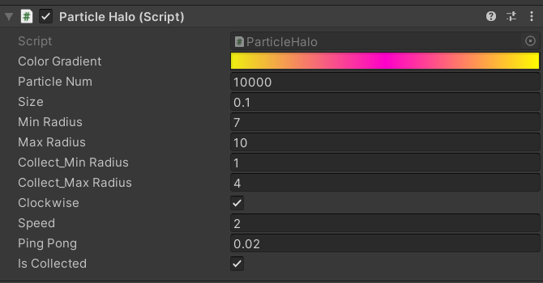
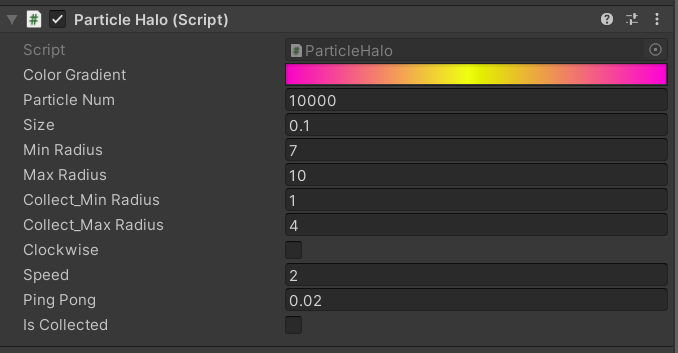

# Homework8-粒子系统与流动效果

## 作业要求

* 参考[这类网站](http://i-remember.fr/en)，使用粒子流编程控制制作一些效果， 如“粒子光环”
  * 可参考以前作业

## 粒子光环效果展示


## 制作过程

* 在菜单->GameObject->Effects->Particle System 创建两个粒子系统，分别命名为clockwise和anticlockwise
* 将实现好的ParticleHalo.cs代码挂载到两个粒子系统中
* 设置anticlockwise的clockwide和iscollected为false
* 根据自己的喜好，在clockwise和anticlockwise的Color Gradient中设置渐变颜色

clockwise:



anticlockwise:



## 代码实现

创建一个ParticleInfo来保存相关粒子的状态信息，包括粒子的半径、角度和持续时间

```
public class ParticalInfo 
{
	public float radius = 0f;
    public float angle = 0f;
    public float time = 0f;

	public ParticalInfo(float radius, float angle, float time)
	{
		this.radius = radius;
		this.angle = angle;
		this.time = time;
	}
}
```

代码的核心部分是在ParticelHalo，首先进行粒子系统、粒子数组、粒子信息数组和一系列变量的定义，并且完成一部分变量的初始化

```
    private ParticleSystem particleSys; //粒子系统
	private ParticleSystem.Particle[] particleArr; //粒子数组 
	private ParticalInfo[] particles; //粒子信息数组
	private float[] radius; 
	private float[] collect_radius;
	private int tier = 10;
	private int time = 0;

	public Gradient colorGradient; //粒子颜色
	public int particleNum = 10000; //粒子数量
	public float size = 0.1f; //粒子大小
	public float minRadius = 7.0f; //外圈的最小半径
	public float maxRadius = 10.0f; //外圈的最大半径
	public float collect_MinRadius = 1.0f; //内圈的最小半径
	public float collect_MaxRadius = 4.0f; //内圈的最大半径

	public bool clockwise = true; //顺时针/逆时针
	public float speed = 2f; //速度
	public float pingPong = 0.02f; //游离范围
	public bool isCollected = true; //内圈/外圈
```

然后在Start函数中实例化粒子系统、初始化各粒子的属性，进行粒子系统的设置

```
	void Start () 
	{
		particleArr = new ParticleSystem.Particle[particleNum];
		particles = new ParticalInfo[particleNum];
		radius = new float[particleNum];
		collect_radius = new float[particleNum];
		particleSys = this.GetComponent<ParticleSystem>();

		particleSys.startSpeed = 0;            
		particleSys.startSize = size; 
		particleSys.loop = false;
		particleSys.maxParticles = particleNum;      
		particleSys.Emit(particleNum); 
		particleSys.GetParticles(particleArr);
		RandomlySpread();
	}
```

在Start函数的末尾调用一个RandomlySpread函数将粒子随机分布到轨道上，具体的实现是：

```
	void RandomlySpread()
	{
		for(int i = 0; i < particleNum; ++i){  
			float midRadius = (maxRadius + minRadius) / 2;
			float minRate = UnityEngine.Random.Range(1.0f, midRadius / minRadius);
			float maxRate = UnityEngine.Random.Range(midRadius / maxRadius, 1.0f);
			float _radius = UnityEngine.Random.Range(minRadius * minRate, maxRadius * maxRate);
			radius[i] = _radius;
			float collect_MidRadius = (collect_MaxRadius + collect_MinRadius) / 2;
			float collect_outRate = Random.Range (1f, collect_MidRadius / collect_MinRadius);
			float collect_inRate = Random.Range (collect_MaxRadius / collect_MidRadius, 1f);
			float _collect_radius = Random.Range (collect_MinRadius * collect_outRate, collect_MaxRadius * collect_inRate);
			collect_radius[i] = _collect_radius;
			
			float angle = UnityEngine.Random.Range(0.0f, 360.0f);
			float theta = angle / 180 * Mathf.PI;
			
			float time = UnityEngine.Random.Range(0.0f, 360.0f);
			if(isCollected == false){
				particles [i] = new ParticalInfo (_radius, angle, time);
			} 
			else{
				particles [i] = new ParticalInfo (_collect_radius, angle, time);
			} 
			particleArr[i].position = new Vector3(particles[i].radius * Mathf.Cos(theta), 0f, particles[i].radius * Mathf.Sin(theta));
		}
		particleSys.SetParticles(particleArr, particleArr.Length);
	}
```

我们在Update函数中实现粒子的旋转。可以通过将每个粒子的每一帧都加上或减掉一个值来实现粒子的旋转。此外需要区别内圈和外圈，需要保证外圈的最小半径大于内圈的最大半径。并且通过调用PingPong函数来实现粒子的漂浮，通过changeColor函数来实现颜色的变化

```
	void Update ()
	{
		for(int i = 0; i < particleNum; i++) {
			if(clockwise){
				particles [i].angle -= (i % tier + 1) * (speed / particles [i].radius / tier);
			}
			else{
				particles [i].angle += (i % tier + 1) * (speed / particles [i].radius / tier);
			}
			particles [i].angle = (360f + particles [i].angle) % 360f;
			float theta = particles [i].angle / 180 * Mathf.PI;
			if(isCollected == true){
				if(particles [i].radius > collect_radius [i]){
					particles [i].radius -= 15f * (collect_radius [i] / collect_radius [i]) * Time.deltaTime;  
				} 
			 	else{
					particles [i].radius = collect_radius [i];
				} 
			} 
			else {
				if(particles [i].radius < radius [i]){
					particles [i].radius += 15f * (collect_radius [i] / collect_radius [i]) * Time.deltaTime;  
				} 
				else{
					particles [i].radius += Mathf.PingPong (particles [i].time / minRadius / maxRadius, pingPong) - pingPong / 2f;
				} 
			}
			particleArr [i].position = new Vector3 (particles [i].radius * Mathf.Cos (theta), 0f, particles [i].radius * Mathf.Sin (theta));
		}
		changeColor ();
		particleSys.SetParticles(particleArr, particleArr.Length);
	}
```

然后通过实现OnGUI函数来实现人机互动，当点击鼠标时，改变内外圈的位置，这个可以通过改变isCollected的方式来改变

```
	void OnGUI()
	{
		if(Input.GetMouseButtonDown(0)){
			time++;
			if(time%2 == 0){
				isCollected = !isCollected;
			}
		}
	}
```

改变颜色的changeColor函数为：

```
	void changeColor()
	{
		float colorValue;
		for(int i = 0; i < particleNum; i++){
			colorValue = (Time.realtimeSinceStartup - Mathf.Floor(Time.realtimeSinceStartup));
			colorValue += particles[i].angle/360;
			while (colorValue > 1) colorValue--;
			particleArr[i].startColor = colorGradient.Evaluate(colorValue);
		}
	}
```

## 运行项目

将该目录下的Assets文件夹替换您自己的文件夹，然后点击启动便可以了
