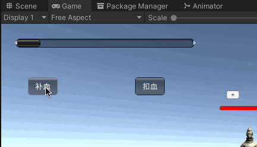
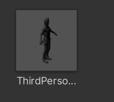
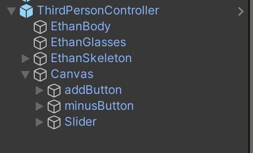
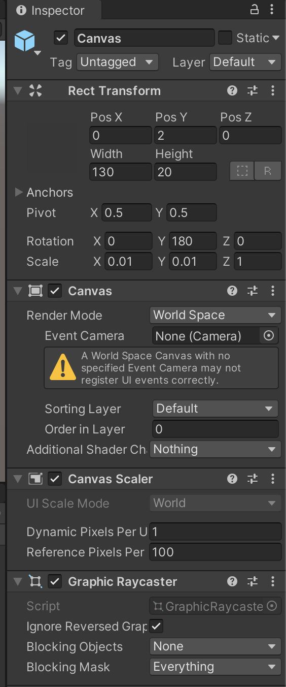
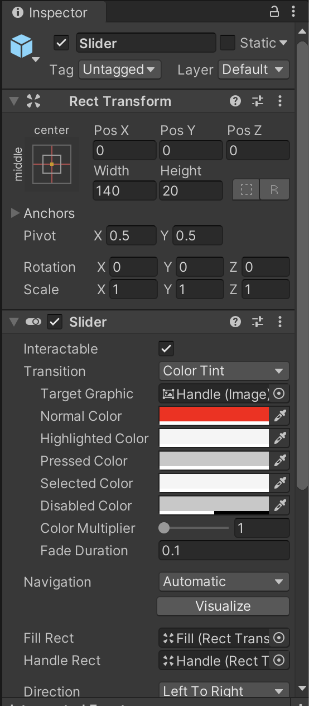
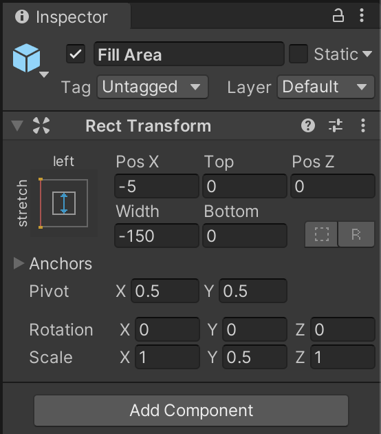
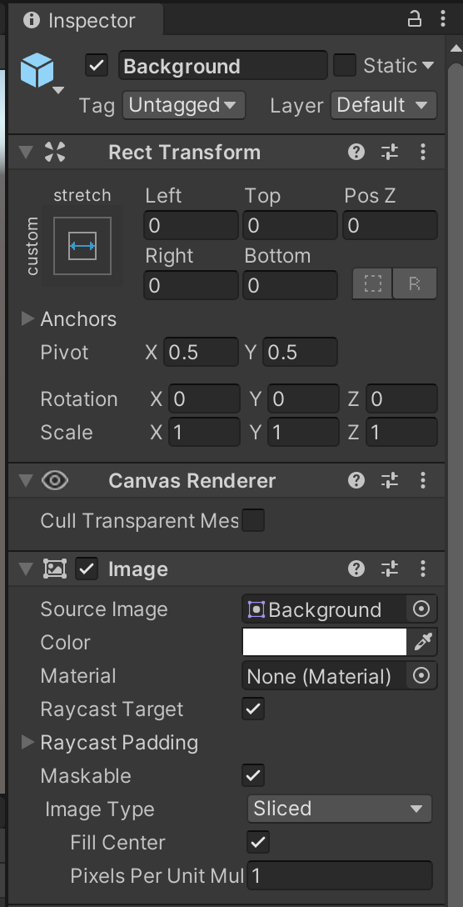
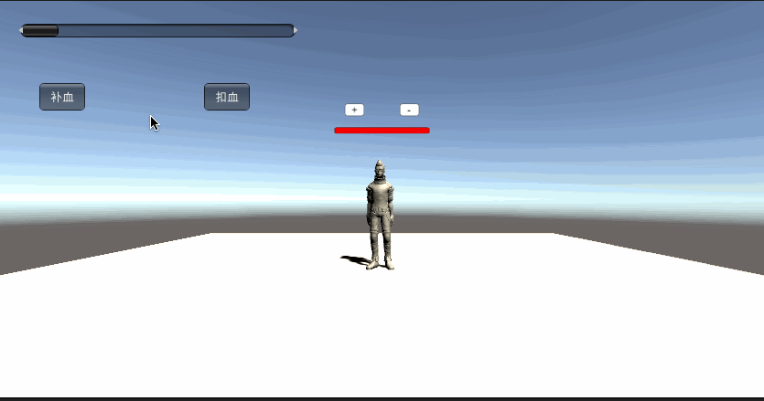
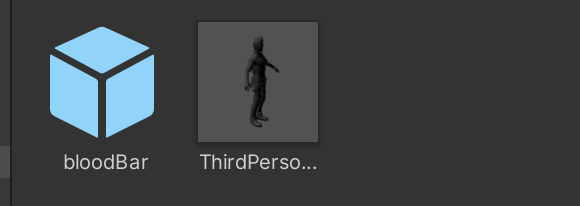
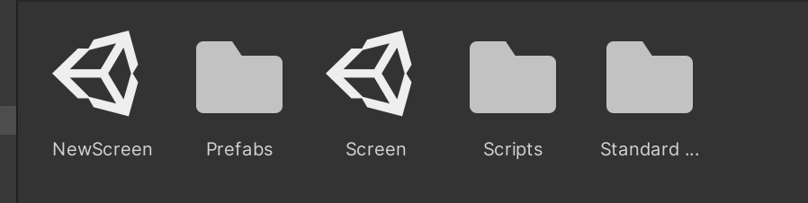

# Homework9-血条UI系统制作

## 作业要求

血条（Health Bar）的预制设计。具体要求如下：
* 分别使用 IMGUI 和 UGUI 实现
* 使用 UGUI，血条是游戏对象的一个子元素，任何时候需要面对主摄像机
* 分析两种实现的优缺点
* 给出预制的使用方法

## IMGUI实现

我们先定义最大血量和初始血量，在`Start`函数中定义初始血量的值：

```
public class bloodBar_script : MonoBehaviour
{
    // 最大血量
    public float maxValue = 10.0f;
    // 当前血量
    public float curValue;
    private float step;
    public Slider BloodSlider;

    private void Start()
    {
        // 初始血量为1.0
        curValue = 1.0f;
        step = 1.0f;
    }

    ...
}

```

然后使用HorizontalScrollbar组件来表示血条的血量：

```
GUI.HorizontalScrollbar(new Rect(25, 25, 300, 50), 0.0f, curValue, 0.0f, maxValue);
```

然后定义两个按钮，分别是`补血`和`扣血`，在点击补血按钮的时候，我们将当前血量加上一个步长值，点击扣血按钮的时候将当前血量减去一个步长值：

```
        if (GUI.Button(new Rect(45, 90, 50, 30), "补血"))
        {
            step += 1.0f;
            if (step > 10.0f)
            {
                step = 10.0f;
            }
        }
        if (GUI.Button(new Rect(225, 90, 50, 30), "扣血"))
        {
            step -= 1.0f;
            if (step < 0.0f)
            {
                step = 0.0f;
            }
        }

```

然后用`Mathf.Lerp`函数来实现血量的平滑变化：

```
curValue = Mathf.Lerp(curValue, step, 0.05f);
```

实现效果为：



## UGUI实现

我们首先选取unity standard assest中的第三人称角色作为我们的人物预制：



然后在人物预制中创建一个Canvas，并在Canvas下面创建两个Button组件`addButton`和`minusButton`，和一个Slider，现在的预制结构如下：



然后将Canvas的的Render Mode设置为World Space，并调整它的大小、宽度和位置，如下图所示：



然后我们再设置血条的颜色为红色，还有它的长度和宽度，在slider里面：



设置填充区域的位置：



设置填充的颜色：



然后编写以下脚本，设置按钮的功能和让血条一直对着摄像头：

```
using System.Collections;
using System.Collections.Generic;
using UnityEngine;
using UnityEngine.UI;

public class bloodBar_GUI : MonoBehaviour {
    private float curBlood = 0f;
    private float targetBlood = 0f;
    public Slider bloodBar;
    GameObject btnPlus, btnMinus;

    private void Start() {
        btnPlus = GameObject.Find("addButton");
        Button a = btnPlus.GetComponent<Button>();
        btnMinus = GameObject.Find("minusButton");
        Button b = btnMinus.GetComponent<Button>();
        a.onClick.AddListener(delegate () {
            this.OnClick(btnPlus);
        });
        b.onClick.AddListener(delegate () {
            this.OnClick(btnMinus);
        });
    }

    private void OnClick(GameObject sender) {
        if (sender.name == "addButton") addBlood();
        if (sender.name == "minusButton") minusBlood();
    }

    public void addBlood() {
        targetBlood = targetBlood - 1f < 0f ? 0f : targetBlood - 1f;
    }

    public void minusBlood() {
        targetBlood = targetBlood + 1f > 10f ? 10f : targetBlood + 1f;
    }

    void Update() {
        curBlood = Mathf.Lerp(curBlood, targetBlood, 0.1f);
        bloodBar.value = curBlood;
        transform.rotation = Quaternion.LookRotation(Vector3.forward);
    }
}
```

实现效果如下：



## 两种实现的优缺点

### IMGUI

* 优点
  * 实现简单，只需要使用GUI的一些组件便可以实现简单的血条，并且不需要挂载在游戏对象上
  * 在某些第一视角游戏（比如FPS游戏），这种实现方法可以让玩家更轻松地获取自己剩余血量的信息
  * 在修改模型，渲染模型这样的经典游戏循环编程模式中，在渲染阶段之后，绘制 UI 界面无可挑剔
* 缺点
  * 在布局的时候需要处理好UI和其他游戏对象的关系，以及没办法完全避免UI阻挡了其他游戏对象而使玩家难以获取其他游戏信息的问题
  * 调试困难，每一帧都需要重新布局重新渲染，效率比较低
  * 无法和某一个游戏对象进行简单的绑定，只能通过类似director之类的管理脚本来实现绑定，但这种实现方式效率低下

### UGUI

* 优点
  * 在实现逻辑上与游戏对象绑定，可以简单实现“每个游戏对象都有对应血条”的功能
  * 支持多模式、多摄像机渲染
  * 面向对象编程的模式对C/C++/C#工程师更加友好
* 缺点：
  * 比起IMGUI更加难以实现，对新手不友好

## 预制的使用方法

* IMGUI实现的血条
  * 直接将prefabs文件夹中的`bloodBar`拖到场景里就行
* UGUI实现的血条
  * 直接将prefabs文件夹中的`ThirdPersonController`拖到场景里就行



或者直接将`NewScreen`拖进场景中：


